# РУКОВОДСТВО ПОЛЬЗОВАТЕЛЯ

## Установка 3D-печати по металлу с одним лазером M-150

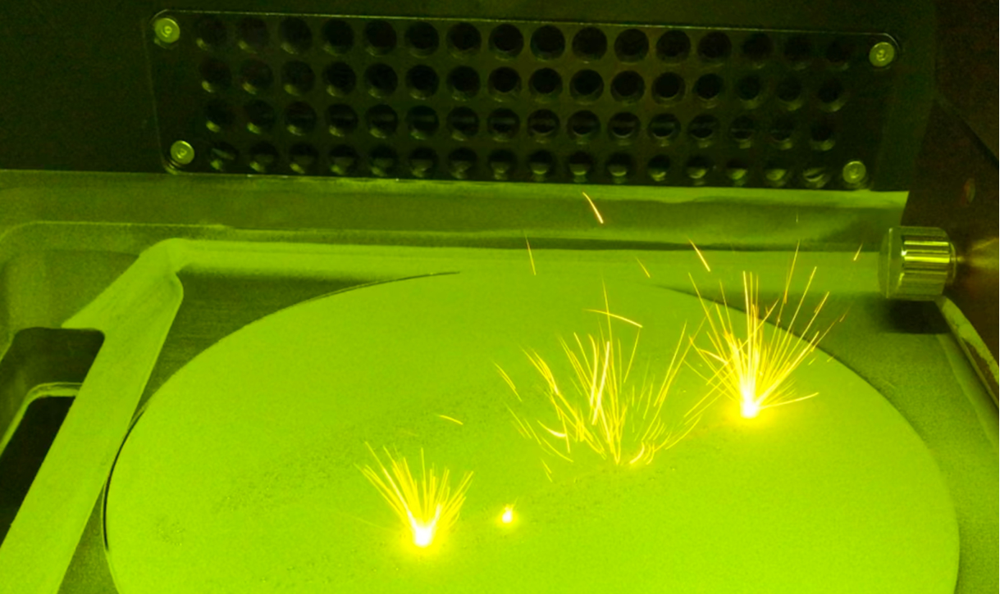

**Изготовитель:** RITON ADDITIVE TECHNOLOGY CO., LTD

Адрес: Building B, Hainan Industrial Zone, Liwan District, Guangzhou 510378, P.R. China
Сайт: www.riton3d.com · Тел.: +86-20-81509265 · Факс: +86-20-81509362 · E-mail: sales@riton3d.com

---

## Содержание

**1. Общие сведения об оборудовании**
- 1.1 [Состав оборудования](#11-состав-оборудования)
- 1.2 [Технические параметры](#12-технические-параметры)

**2. Эксплуатация оборудования**
- 2.1 [Включение и выключение установки](#21-включение-и-выключение-установки)
  - 2.1.1 [Порядок включения](#211-порядок-включения)
  - 2.1.2 [Порядок выключения](#212-порядок-выключения)
- 2.2 [Работа с управляющим программным обеспечением](#22-работа-с-управляющим-программным-обеспечением)
  - 2.2.1 [Работа с управляющей программой 3DPrint](#221-работа-с-управляющей-программой-3dprint)
  - 2.2.2 [Работа с программой раскладки VoxelDance Additive — RITON DENTAL](#222-работа-с-программой-раскладки-voxeldance-additive--riton-dental)
- 2.3 [Загрузка и выгрузка](#23-загрузка-и-выгрузка)
  - 2.3.1 [Загрузка и подготовка к печати](#231-загрузка-и-подготовка-к-печати)
  - 2.3.2 [Выгрузка после печати](#232-выгрузка-после-печати)

**3. Техническое обслуживание установки**
- 3.1 [Обслуживание оборудования](#31-обслуживание-оборудования)
- 3.2 [Обслуживание системы фильтрации и циркуляции газа](#32-обслуживание-системы-фильтрации-и-циркуляции-газа)
- 3.3 [Замена гибкого ракеля](#33-замена-гибкого-ракеля)
- 3.4 [Запреты при обслуживании оборудования](#34-запреты-при-обслуживании-оборудования)

**4. [Типовые неисправности и способы их устранения](#4-типовые-неисправности-и-способы-их-устранения)**

---

# 1. Общие сведения об оборудовании

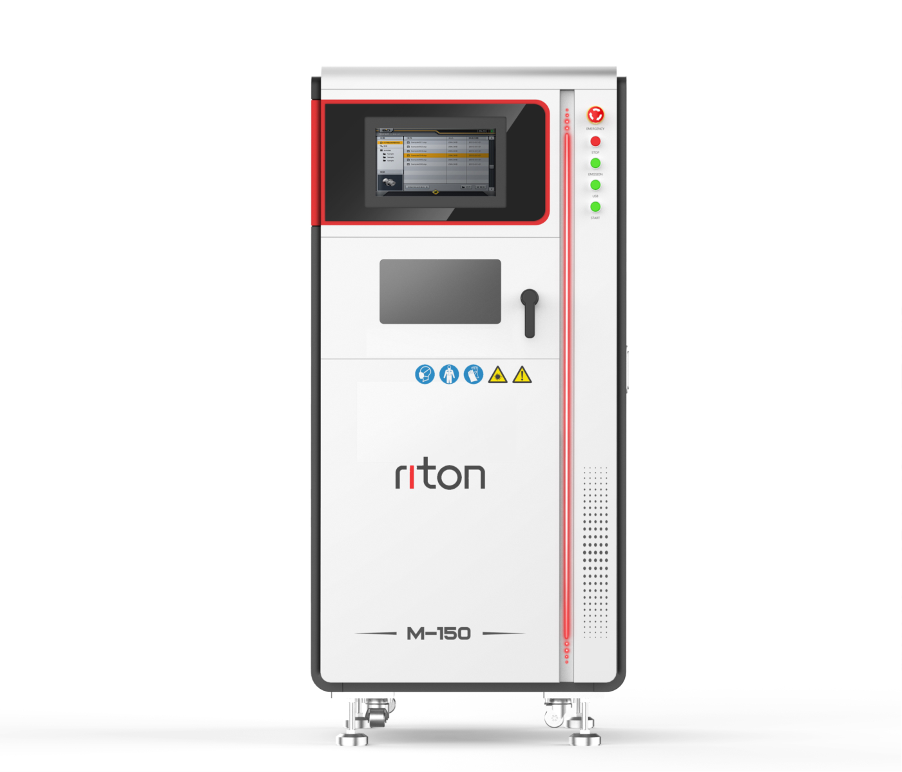

## 1.1 Состав оборудования

Установка 3D-печати с одним лазером состоит из лазерной системы, оптической сканирующей системы, системы управления перемещениями, системы циркуляции и очистки защитного газа, системы человеко-машинного интерфейса, системы водяного охлаждения и других узлов.

### Лазерная система

В установке применён волоконный лазер с отличным качеством пучка и исключительно высокой стабильностью.

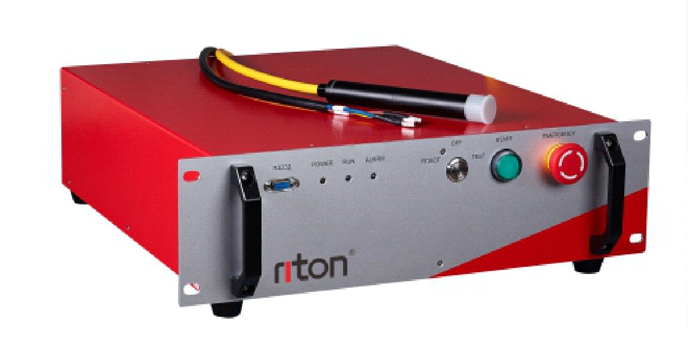

### Оптическая сканирующая система

Сканирующая система установки — высокоточная, построена на прецизионном гальванометрическом сканаторе и высококачественном объективе. Она отличается хорошей герметичностью, защитой от влаги и пыли, малыми габаритами, компактностью и прочностью конструкции, высокой мощностью и исключительно стабильными характеристиками, что обеспечивает длительную безотказную работу установки в непрерывном режиме.

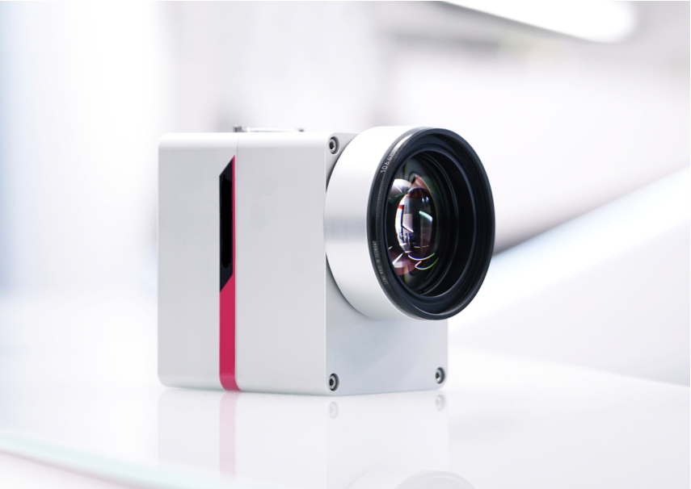

### Система управления перемещениями

В установке применены серводвигатели Mitsubishi (Япония), обеспечивающие управление приводами узла построения. Они отличаются высоким быстродействием, высокой точностью позиционирования и развитыми функциями автоматической настройки, что позволяет без труда подобрать коэффициенты усиления контура.

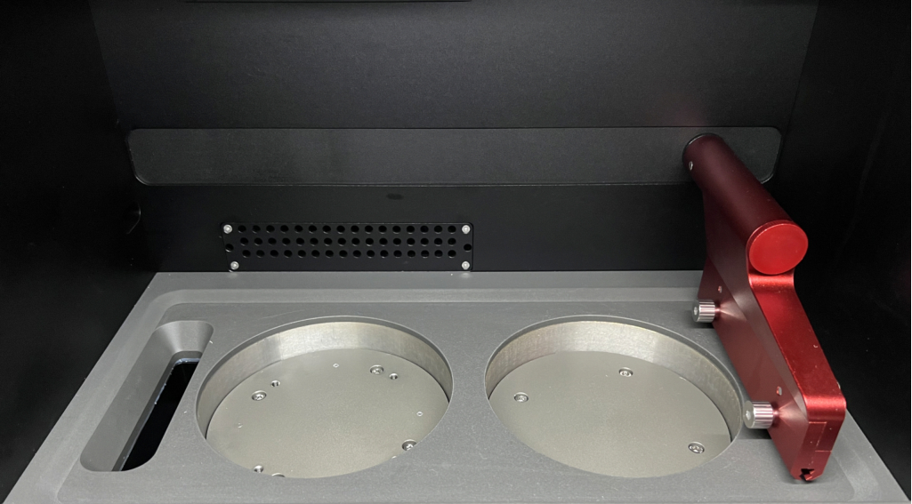

### Система циркуляции и очистки защитного газа

Система циркуляции и очистки газа данной установки включает четыре части: впускной клапан, выпускной клапан, один высокоточный газоанализатор содержания кислорода и встроенный фильтр-циркулятор.

> **Примечание.** При печати титановыми сплавами система циркуляции и очистки газа включает четыре части: впускной клапан, выпускной клапан, **два** высокоточных газоанализатора содержания кислорода и **выносной** фильтр-циркулятор (см. рисунки ниже).

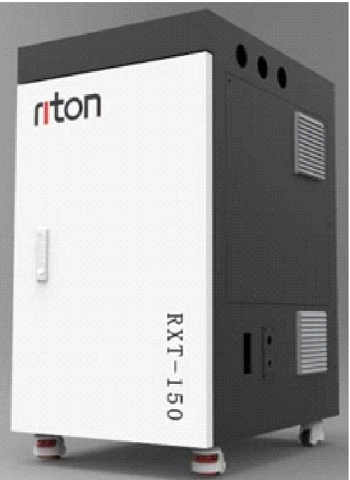

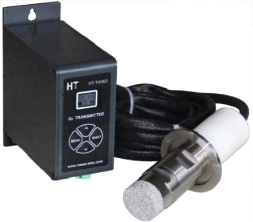

### Система человеко-машинного интерфейса

Программное обеспечение человеко-машинного интерфейса установки — это управляющая программа 3DPrinter собственной разработки для лазерных установок 3D-печати. Она реализует импорт файлов сканирования, задание технологических параметров, управление системой нанесения порошка, управление системой сканирования, запуск лазерной системы, контроль контурной информации в реальном времени и другие функции.

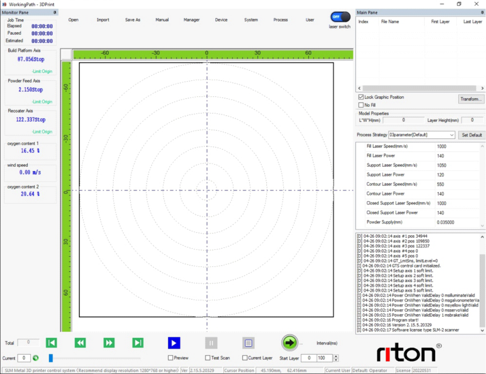

### Система водяного охлаждения

Чиллер для лазера — специализированное охлаждающее оборудование данной установки. Чиллер оснащён интеллектуальной регулируемой системой охлаждения с автоматическим термостатированием, что существенно повышает стабильность поддержания температуры.

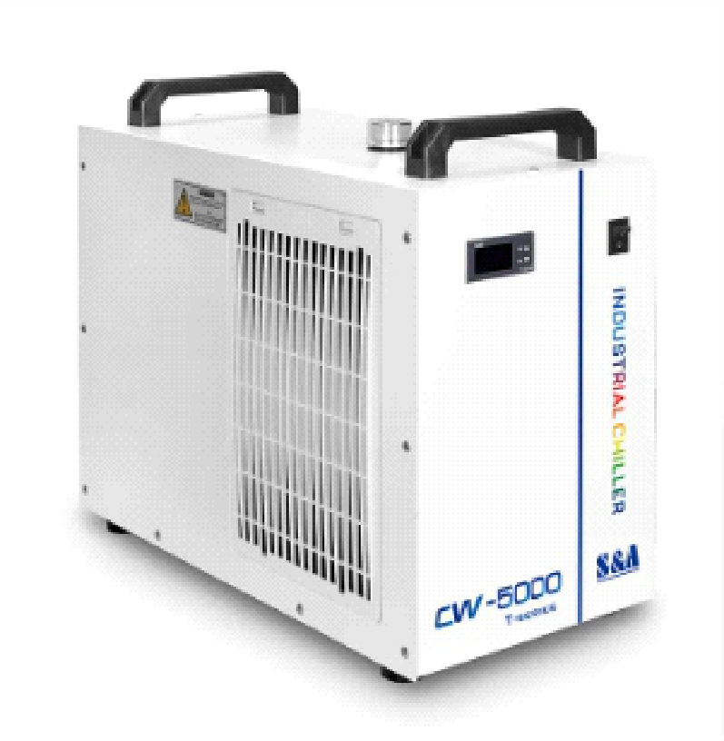

> **Примечание.** Если температура окружающего воздуха ниже 16 °C, перед печатью необходимо заранее включить чиллер лазера. После того как температура охлаждающей воды в чиллере поднимется до 25 °C, выключите лазер в программе и включите его снова — после этого установка будет работать нормально.

## 1.2 Технические параметры

*Таблица 1.1 — Основные параметры установки 3D-печати по металлу с одним лазером*

| Наименование | Значение |
|---|---|
| Модель | M-150 |
| Масса основного блока | 500 кг |
| Габариты основного блока | 790 × 1000 × 1660 мм |
| Размер зоны построения | ⌀150 × 100 мм |
| Материалы построения | кобальт-хромовый сплав, титановый сплав и др. |
| Напряжение питания | 220 В |
| Потребляемая мощность | 3 кВт |
| Лазерная система | волоконный лазер мощностью 500 Вт |
| Длина волны излучения | 1,064 мкм |
| Диаметр сфокусированного пятна | 20–60 мкм |
| Толщина слоя построения | 20–60 мкм |
| Скорость сканирования | 0–7000 мм/с |
| Требования к защитному газу | азот или аргон |
| Производительность | 200 коронок или 14 бюгельных каркасов за 4,5 часа |
| Температура окружающего воздуха | 15–35 °C |
| Относительная влажность воздуха | < 95 % |
| Уровень шума | < 70 дБ |

---

# 2. Эксплуатация оборудования

## 2.1 Включение и выключение установки

### 2.1.1 Порядок включения

1. **Вода.** Заправьте чиллер деионизированной водой (при первом пуске).
2. **Электропитание.** Включите автоматический выключатель — на установку подаётся переменное напряжение 220 В (внимание: розеточный блок обязательно должен иметь заземляющий провод).
3. Нажмите зелёную кнопку пуска.
4. Через несколько секунд промышленный компьютер запустится автоматически.
5. Запустите управляющую программу 3DPRINTER. Войдя в интерфейс управления, выполните возврат в исходное положение для ракеля, цилиндра построения и цилиндра подачи порошка.
6. Выполните загрузку и подготовку к печати (подробно см. п. 2.3.1).

### 2.1.2 Порядок выключения

1. Выполните выгрузку (подробно см. п. 2.3.2).
2. Закройте дверь камеры построения.
3. Закройте управляющую программу 3DPRINTER.
4. Выключите промышленный компьютер.
5. Нажмите красную кнопку останова.
6. Отключите автоматический выключатель.

## 2.2 Работа с управляющим программным обеспечением

### 2.2.1 Работа с управляющей программой 3DPrint

Содержание раздела:

1. Интерфейс системы
2. Проверка и подготовка перед печатью
3. Импорт файлов печати и их проверка
4. Подготовка камеры построения
5. Запуск печати
6. Возобновление печати после отключения питания
7. Управление пользователями и права доступа
8. Работа с файлами
9. Прочие указания

#### 1. Интерфейс системы

#### 2. Проверка и подготовка перед печатью

1. Двойным щелчком запустите программу. Блокировка, сервопривод, освещение и жёлтая сигнальная лампа по умолчанию включаются автоматически.
2. Нажмите соответствующую кнопку — включение индицирует, что лазер, разрешение выдачи энергии и пилотный (красный) луч включены.
3. Проверьте, нормально ли работают ось цилиндра построения, ось цилиндра подачи порошка и ось ракеля (см. рисунок). Если работа ненормальна, нажмите кнопку в верхней части интерфейса, откройте окно ручного управления, выберите нужную ось и обнулите её положение.

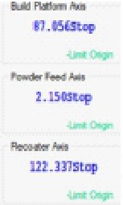

> **Примечание.** Если нулевое положение оси цилиндра подачи порошка задано в верхней точке, при возврате в ноль следите за сбором порошка, чтобы он не высыпался за пределы цилиндра.

4. Если требуется замена уплотнительного кольца, проверьте перемещение оси в нужном объёме, а после замены проверьте демонтаж.
5. Откройте газовый вентиль, проверьте давление газа и его остаток в баллоне.

#### 3. Импорт файлов печати и их проверка

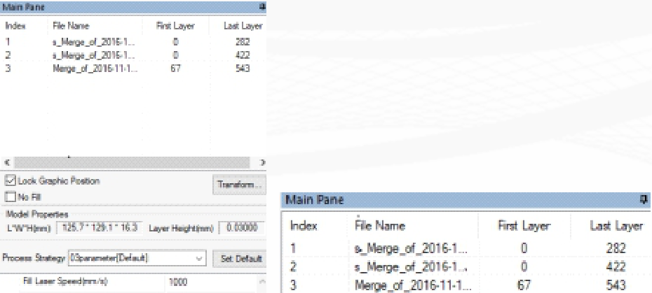

1. Нажмите кнопку выбора файла печати и проверьте, что модель размещается в пределах рабочей зоны.
2. Установите флажок проверки и нажмите кнопку контроля: правильно ли построена модель, нет ли незакрытых отверстий и иных ошибок. После проверки снимите флажок.
3. Выберите пакет технологических параметров, который будет использоваться. Если этот пакет применяется постоянно, его можно назначить пакетом по умолчанию — тогда он будет применяться и к файлам формата BP.
4. Столбцы списка файлов, по порядку: номер по порядку, имя файла печати, номер начального слоя, номер конечного слоя.
   - Флажок блокировки модели установлен по умолчанию; снимите его, чтобы модель можно было перемещать.
   - Флажок заливки по умолчанию снят — в этом состоянии заливка контура печатаемой модели не выполняется.
5. Свойства импортированной модели — параметры редактирования импортируемого изображения.

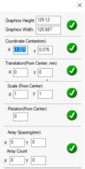

#### 4. Подготовка камеры построения

1. Установите подложку построения, нажмите кнопку ручного управления, откройте окно ручных перемещений, отрегулируйте положение каждой оси и убедитесь, что они находятся в правильных положениях.

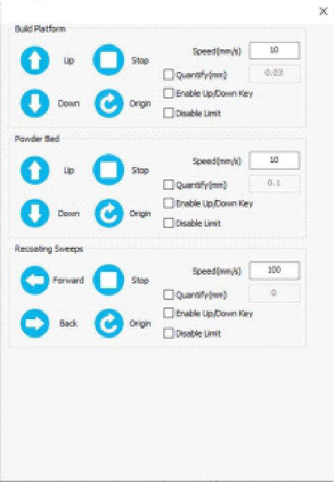

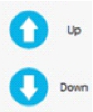

- Скорость перемещения оси задаётся отдельно.
- При установленном флажке перемещение выполняется на заданную величину; если флажок снят — перемещение свободное.

2. В режиме «Technical Support» (техническая поддержка) нажмите кнопку входа в интерфейс проверки лазера. Выходную мощность можно задать в соответствии с требованиями.

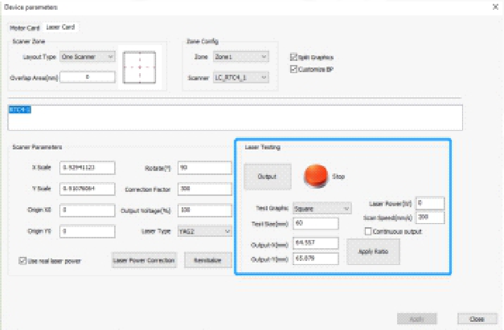

3. Закройте блокировку и дверь камеры построения — установка готова к работе.

#### 5. Запуск печати

Нажмите кнопку пуска: начинается печать, выполняется подготовительный цикл, при этом автоматически контролируется соответствие газовой среды рабочим требованиям.

Система автоматически включает продувку до тех пор, пока оба датчика содержания кислорода не покажут, что газовая среда камеры соответствует требованиям печати; после этого начинается собственно печать. Жёлтая сигнальная лампа автоматически гаснет, включается зелёная.

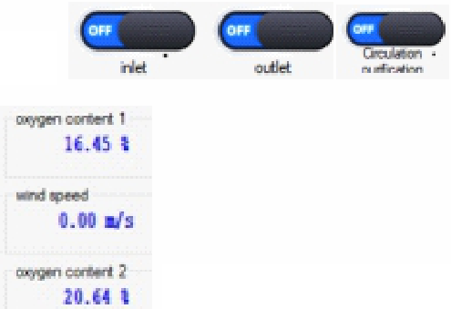

#### 6. Возобновление печати после отключения питания

1. После сбоя питания при первом запуске программы появится запрос; по умолчанию выбран вариант «Сохранить метку возобновления после отключения питания» — нажмите OK. Число в правом нижнем углу указывает номер слоя, с которого продолжается печать.

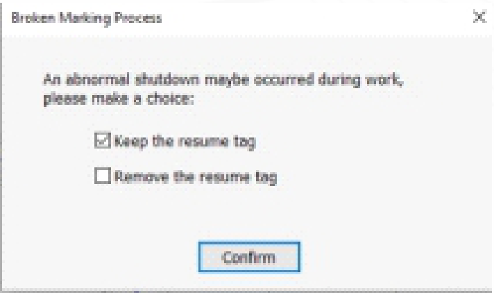

Если вместо номера отображается «1», это номер слоя, сохранённый в программе печати. Если номер слоя по каким-либо причинам не был записан, откройте журнал, найдите последнюю запись за соответствующее время и определите номер последнего напечатанного слоя — это и есть слой, на котором произошло отключение питания.

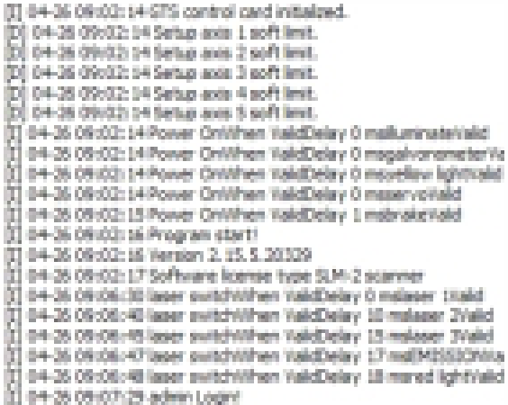

2. Введите соответствующий номер начального слоя и нажмите кнопку пуска. Появится предупреждение — подтвердите его.

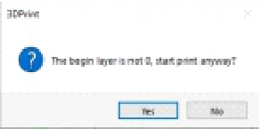

Затем программа спросит, нужно ли поднять цилиндр построения и цилиндр подачи порошка (при возврате каретки ракеля оба цилиндра опускаются на 0,5 мм).

> **Важно!** Убедитесь, что оба цилиндра находятся на уровне рабочей поверхности, иначе возобновление печати завершится неудачей.
>
> - Если цилиндры на уровне рабочей поверхности — поднимать не нужно, выберите «Нет».
> - Если они не на уровне рабочей поверхности (при возврате каретки ракеля оба цилиндра опускаются, чтобы избежать задевания) — выберите «Да».

> **Примечание.** Чтобы улучшить качество поверхности при возобновлении печати, убедившись, что цилиндр построения и цилиндр подачи порошка находятся на уровне рабочей поверхности, можно вручную опустить цилиндр построения на толщину одного слоя (чтобы количество порошка было меньше) и поднять цилиндр подачи порошка на 0,5 мм (чтобы обеспечить достаточную подачу порошка).

#### 7. Управление пользователями и права доступа

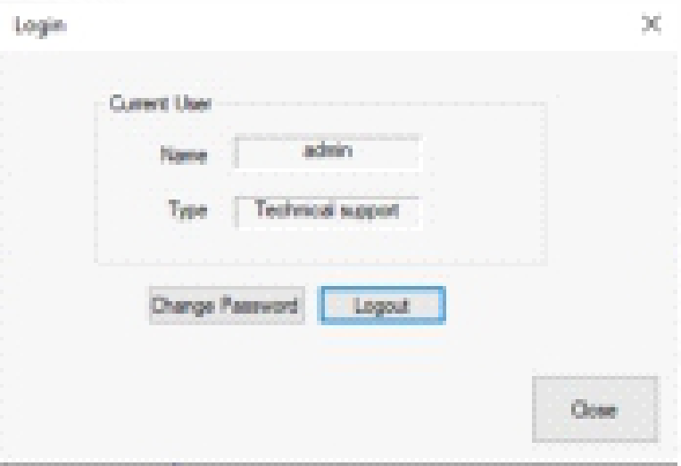

1. Нажмите соответствующий пункт для настройки прав доступа к программе и войдите в систему.
2. Введите имя пользователя и пароль, чтобы получить соответствующий уровень прав. Уровни организованы по убыванию: старший уровень включает права младшего, а младший уровень не может выполнять операции старшего.
3. В системе предусмотрены два уровня — «Technical support» (техническая поддержка) и «Operator» (оператор):
   - **Techical support** — управление системными настройками, управление пользователями, права управления печатью, комплексное управление оборудованием, изменение параметров технологического процесса печати;
   - **Operator** — права управления печатью, изменение скорости печати и параметров мощности.
4. В процессе печати пользователь уровня «Technical support» может изменять рабочие параметры и контролировать состояние оборудования; остальные операции заблокированы. Для внесения других изменений печать необходимо предварительно остановить.

#### 8. Работа с файлами

1. В программу можно напрямую импортировать любой файл форматов BP, CLI или SLC.
2. Если после настройки соответствующих параметров требуется сохранить файл для следующей печати, нажмите кнопку сохранения и выберите папку (папку необходимо выбрать до сохранения), нажмите «Сохранить» и задайте имя файла. Исходный файл копируется в выбранную папку; при последующем выборе этого файла вызываются сохранённые технологические параметры.
3. Система может также сохранять файлы автоматически в отдельную папку, однако такая запись действительна только в течение текущего сеанса: при открытии файла предыдущий автоматически сохранённый файл удаляется.

#### 9. Прочие указания

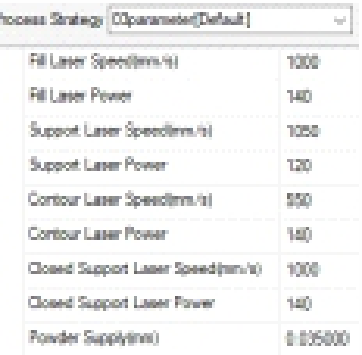

1. В окне справа можно изменять параметры в процессе печати — в пределах имеющихся прав доступа.
2. Окно справа является окном наблюдения за ходом печати: в нём можно быстро оценить текущий прогресс работы.

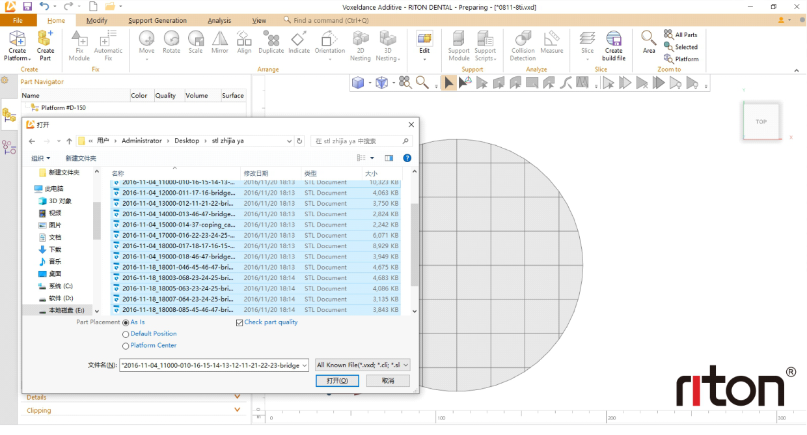

3. Выводятся номер текущего слоя и номер начального слоя, а работа лазера выполняется по пакету технологических параметров, назначенному по умолчанию.
4. Примечания отображаются в левой нижней части окна.

### 2.2.2 Работа с программой раскладки VoxelDance Additive — RITON DENTAL

#### Раскладка коронок

Исходя из принципов SLM-печати по металлу, к направлению установки и способу поддержки зубных мостов и коронок предъявляются особые требования. С помощью программы подготовки к 3D-печати VoxelDance Additive — RITON DENTAL выполняется предварительная обработка данных STL, что обеспечивает эффективную и удобную раскладку.

**а) Откройте платформу печати и пакетно импортируйте данные.** Двойным щелчком по значку программы откройте платформу устройства D-150; в панели быстрого доступа нажмите «Open File» и импортируйте нужные файлы формата STL.

**б) Проверьте качество данных коронок.** В столбце «Quality» списка деталей можно быстро оценить качество данных: значок «√» означает, что деталь без дефектов; значок «!» означает, что требуется исправление — для быстрого восстановления используйте автоматические или полуавтоматические инструменты ремонта.

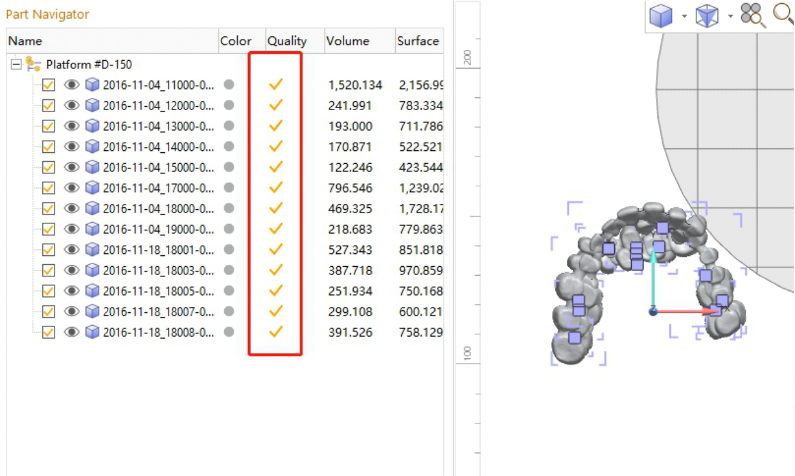

**в) Отрегулируйте угол установки коронок.** Импортированные детали обычно расположены навалом и ориентированы неупорядоченно. С помощью инструментов «Rotation» (поворот), «Automatic placement» (автоматическая расстановка), «Move and place» (перемещение и размещение) разнесите детали и подберите каждой подходящий угол так, чтобы окклюзионная (жевательная) поверхность была обращена вверх. В программе есть и специальный инструмент установки коронок, выполняющий размещение одним нажатием.

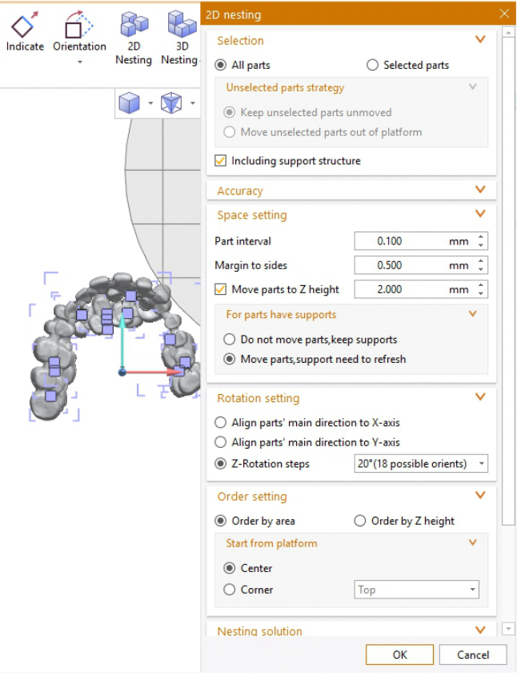

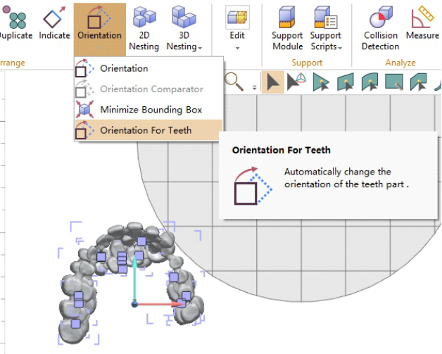

После автоматической расстановки положение деталей можно скорректировать, размещая их как можно плотнее. В завершение с помощью функции «Collision detection» (контроль пересечений) проверьте, не соприкасаются ли поддержки между собой.

**г) Добавьте блочные (перекрёстные) поддержки.** Выделите все детали, нажмите «Support Script» и выберите сценарий «Crown Cross Block». Затем выберите детали протяжённых мостов (от четырёх единиц) и запустите сценарий «Crown Cross». В завершение объедините все детали, сохранив существующие поддержки. На запрос об удалении исходной детали ответьте подтверждением.

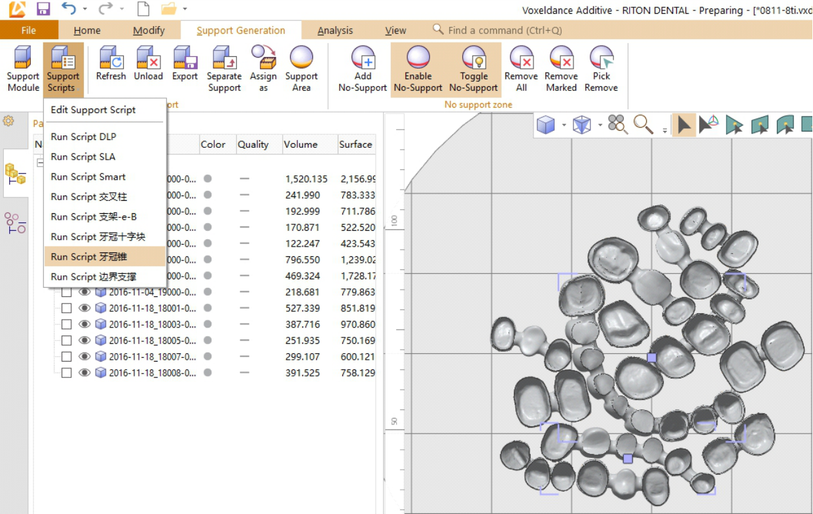

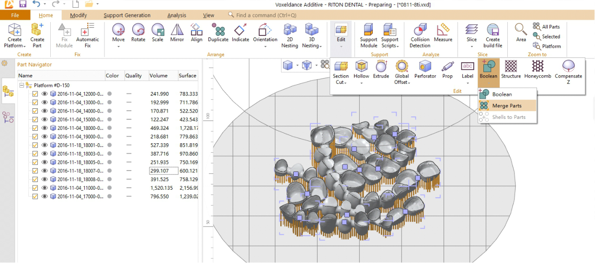

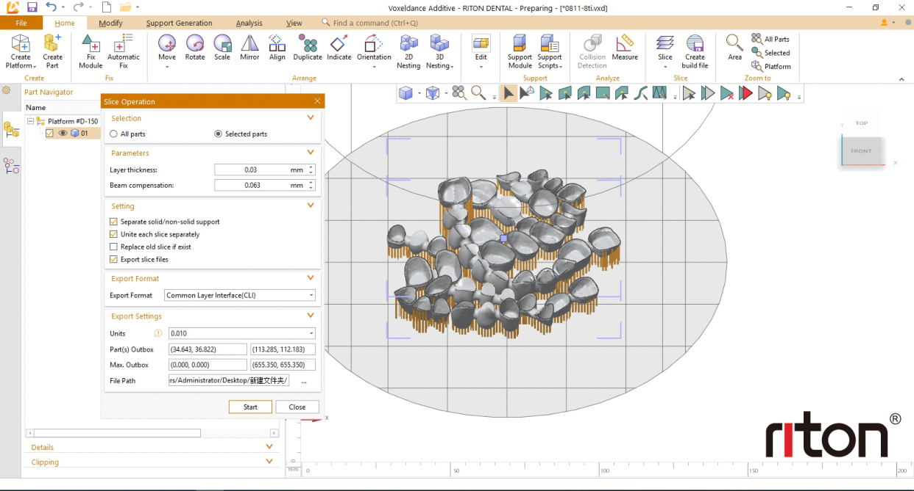

**д) Постройте слои (слайсинг).** Выберите инструмент слайсинга, задайте толщину слоя (30 мкм) и нажмите «Start» — слои будут сформированы за 3–5 секунд. Здесь же задаётся путь экспорта: по завершении файл слоёв автоматически сохраняется по указанному пути.

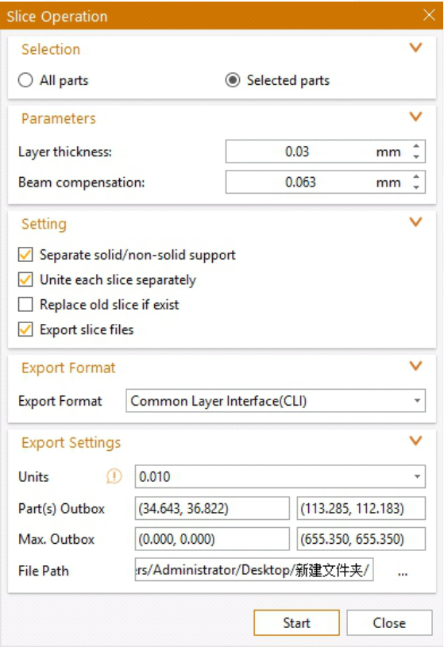

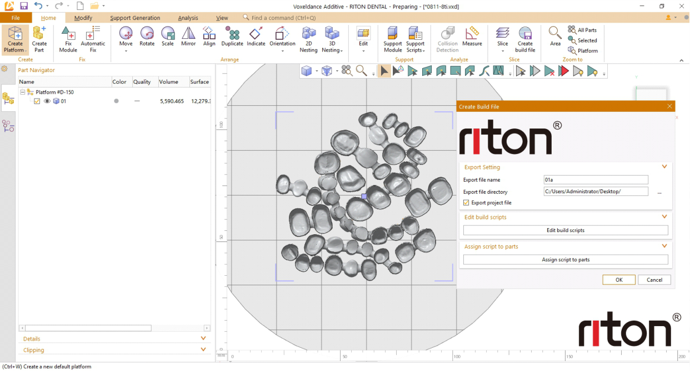

**е) Постройте траектории и сформируйте файл печати.** Выделите все данные слоёв, создайте задания обработки, назначьте деталям заранее подготовленный сценарий обработки, выберите путь сохранения и нажмите OK — будет сформирован файл формата **RTP**, пригодный для непосредственной печати. Путь экспорта также задаётся здесь; по завершении расчёта файл RTP автоматически сохраняется по указанному пути.

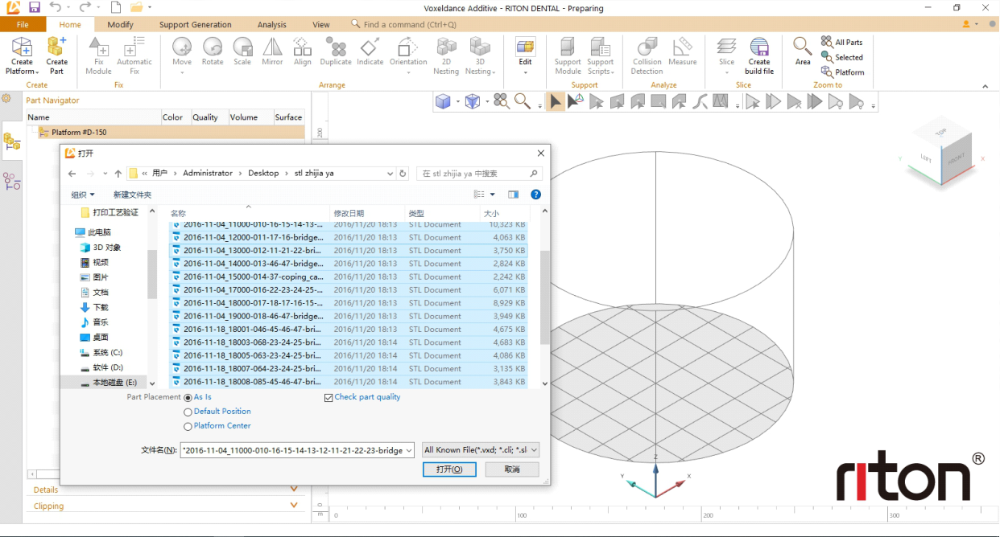

На одной платформе установка позволяет разместить до 200 коронок с данными для левой и правой стороны. Полная обработка данных занимает около 10 минут.

#### Раскладка бюгельных каркасов

Исходя из принципов SLM-печати по металлу, печать съёмных бюгельных каркасов имеет свои особенности. На этапе предварительной обработки данных способ добавления и удаления поддержек влияет на точность, а угол установки каркаса — на плотность прилегания и производительность построения. С учётом этих особенностей предварительная обработка данных STL выполняется в программе VoxelDance Additive — RITON DENTAL, что обеспечивает эффективную и удобную раскладку.

**а) Откройте платформу печати и пакетно импортируйте данные каркасов.** Двойным щелчком по значку программы откройте платформу устройства; в панели быстрого доступа нажмите «Open File» и импортируйте нужные файлы формата STL.

**б) Проверьте качество данных каркасов.** В столбце «Quality» списка деталей оцените качество данных: «√» — деталь без дефектов, «!» — требуется исправление; для быстрого восстановления используйте автоматические или полуавтоматические инструменты ремонта.

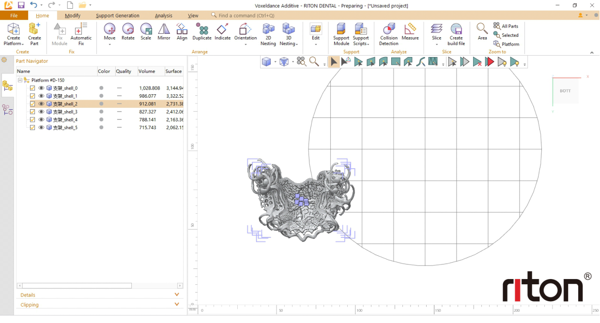

**в) Отрегулируйте угол установки каркасов.** Импортированные детали обычно расположены навалом и ориентированы неупорядоченно. Инструментами «Rotation», «Automatic placement» и «Move and place» разнесите детали и подберите каждому каркасу подходящий угол установки так, чтобы прилегающая поверхность была обращена вверх, а рельефная — вниз. При этом угол наклона основной прилегающей поверхности не должен выходить за центральную ось; каркас следует устанавливать по возможности круче, чтобы уменьшить площадь нависающих поверхностей и тем самым снизить повреждение рельефа поддержками.

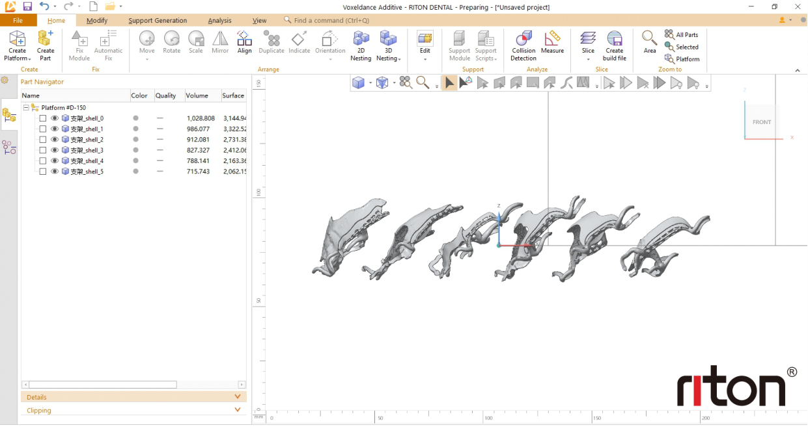

**г) Добавьте усиливающие рёбра (стойки).** Инструментом «Create pillar» добавьте к каркасу необходимое количество усиливающих стержней, предотвращающих деформацию каркаса в процессе печати. Усиливающие стержни следует располагать по возможности параллельно плоскости подложки, а вспомогательные и основные стержни — по возможности перпендикулярно друг другу.

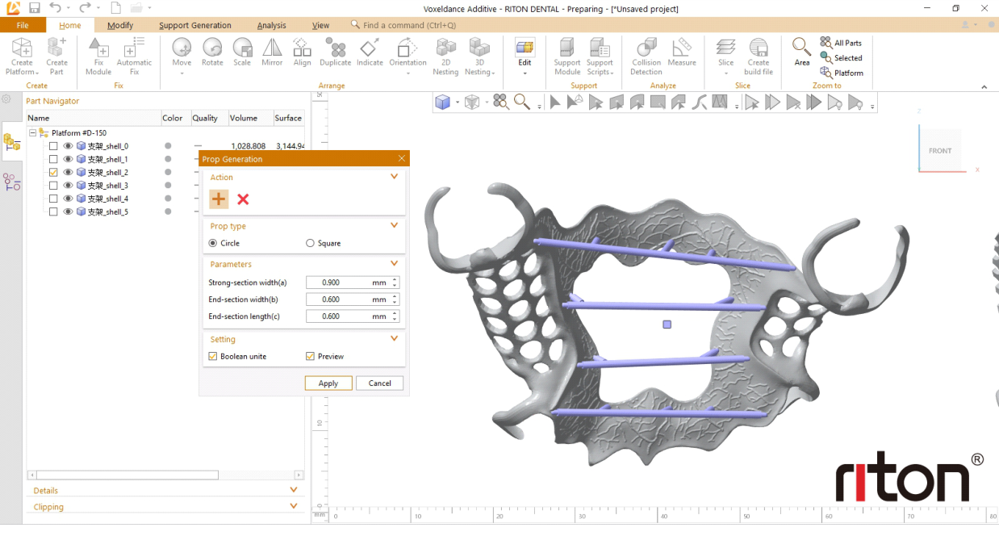

**д) Разместите каркасы в пределах платформы.** Выделите все детали, задайте высоту деталей над подложкой 2,5 мм и переместите каркасы с поддержками на платформу по одному. Пока детали не пересекаются в трёхмерном пространстве, их можно располагать как можно плотнее. В завершение функцией «Collision detection» проверьте, не соприкасаются ли поддержки между собой.

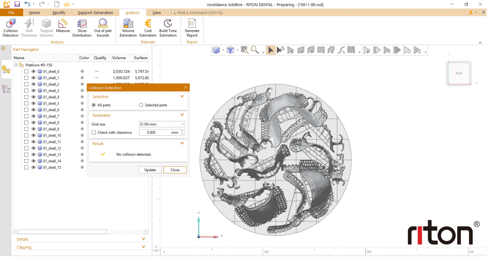

**е) Добавьте линейные и столбчатые вспомогательные поддержки.** Последовательно выбирая детали каркасов, перейдите в режим ручного построения поддержек; обведите язычную пластину каркаса, дуги и кромки пластин, создайте новую поверхность поддержки и запустите сценарий линейных поддержек. В сетчатых участках деталей добавьте некоторое количество столбчатых поддержек, чтобы усилить связь детали с подложкой и предотвратить коробление.

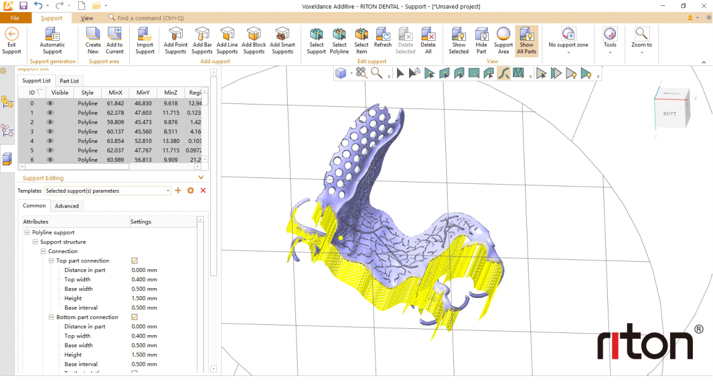

**ж) Добавьте интеллектуальные поддержки.** Объединив все детали с сохранением существующих поддержек, запустите сценарий интеллектуальных поддержек — для всех деталей будут построены специальные поддержки.

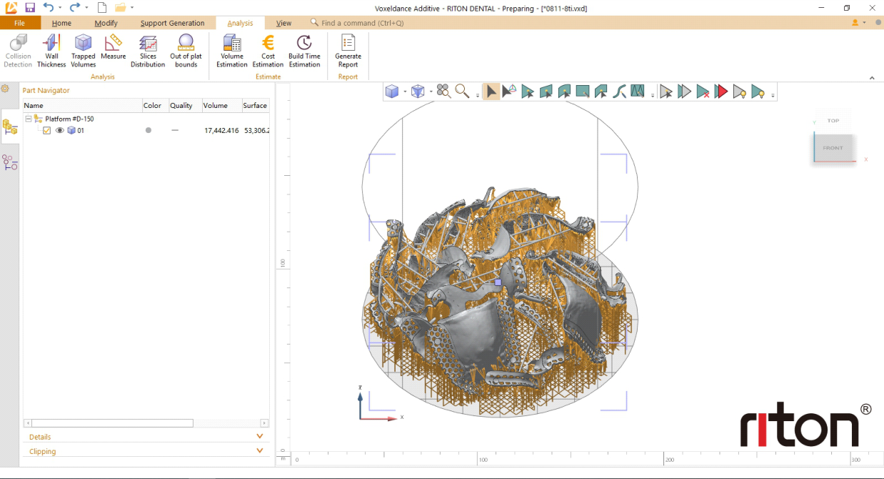

**з) Постройте слои (слайсинг).** Выберите инструмент слайсинга, задайте толщину слоя (40 мкм) и нажмите «Start» — слои будут сформированы за 3–5 секунд. Путь экспорта задаётся здесь же; по завершении файл слоёв автоматически сохраняется по указанному пути.

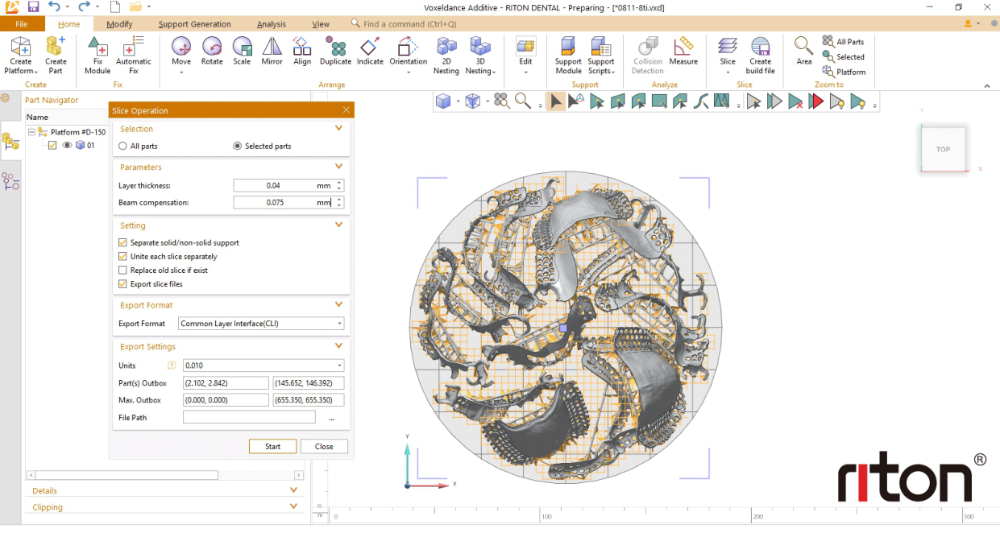

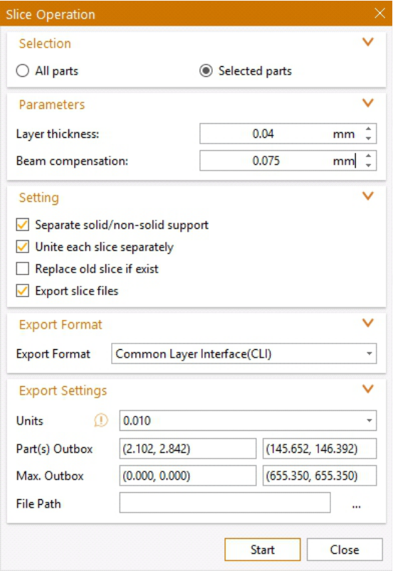

**и) Постройте траектории и сформируйте файл печати.** Выделите все данные слоёв, создайте задания обработки, назначьте деталям заранее подготовленный сценарий обработки, выберите путь сохранения и нажмите OK — будет сформирован файл формата **RTP**, пригодный для непосредственной печати. По завершении расчёта файл RTP автоматически сохраняется по заданному пути.

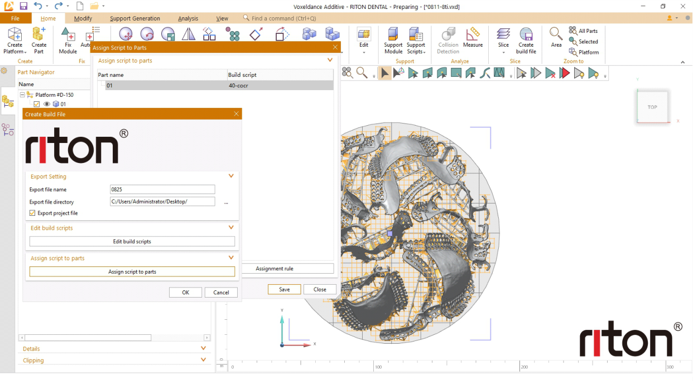

На одной платформе установка позволяет разместить до 15–17 бюгельных каркасов. Полная обработка данных занимает около 30 минут.

## 2.3 Загрузка и выгрузка

### 2.3.1 Загрузка и подготовка к печати

1. Перед загрузкой обеспечьте средства индивидуальной защиты, чтобы порошок не причинил вреда здоровью. Наденьте респиратор и медицинские перчатки, работайте в одежде с длинным рукавом (предпочтительно в защитном костюме), плотно затянув манжеты.
2. Подготовьте новую подложку. Подложку необходимо отшлифовать до ровного состояния, чтобы на поверхности не было выступов и впадин, после чего обработать поверхность пескоструйно для устранения зеркального эффекта.
3. Очистите подложку: удалите загрязнения с её поверхности пылесосом и протрите спиртом, чтобы подложка была чистой и без посторонних включений.
4. **Просейте порошок.** Перекройте вентиль цилиндра подачи порошка, снимите цилиндр и просейте находящийся в нём порошок, удалив посторонние включения. После просеивания установите цилиндр на место, откройте его вентиль и откройте клапан сброса давления.
5. Убедитесь, что опорная поверхность камеры построения ровная и чистая, а резьбовые отверстия не забиты порошком, и установите подложку.
6. **Выровняйте подложку по уровню порошка.** Отрегулируйте положение цилиндра построения так, чтобы поверхность подложки подошла вплотную к ракелю, затем в пошаговом режиме точно подведите подложку вверх. Результат должен быть следующим: по поверхности подложки равномерно распределён тонкий слой порошка, сквозь который подложка отчётливо просматривается; зазоры вокруг подложки также заполнены порошком, а поверхность цилиндра подачи порошка выровнена ракелем. По завершении выравнивания ракель остаётся со стороны цилиндра подачи порошка.
7. **Протрите оптику.** Аккуратно протрите защитное стекло сканирующей системы (движениями от центра по кругу, не возвратно-поступательно) и стекло двери камеры.
8. Закройте дверь камеры, откройте вентиль баллона защитного газа и установите давление 0,2 МПа.
9. Нажмите кнопку выбора файла печати, проверьте, что модель размещается в пределах рабочей зоны, установите флажок проверки и нажмите кнопку контроля: правильна ли модель, нет ли незакрытых отверстий и иных ошибок. После проверки снимите флажок.
10. Нажмите соответствующую кнопку — включение индицирует, что лазер, разрешение выдачи энергии и пилотный луч включены.
11. Ещё раз убедитесь, что двери камеры закрыты, и нажмите кнопку пуска печати.

После запуска печати программа автоматически откроет впускной и выпускной клапаны для вытеснения кислорода. Отрегулируйте маховичок «расход при продувке» так, чтобы расход защитного газа составил 30–40 л/мин. Когда газоанализатор зафиксирует, что содержание кислорода в камере построения ниже 0,03 %, программа автоматически начнёт печать; после этого маховичком «расход поддержания» уменьшите расход газа до 1–3 л/мин.

### 2.3.2 Выгрузка после печати

1. Перед выгрузкой также обеспечьте средства индивидуальной защиты и подготовьте необходимый инструмент: кисть для порошка, пылесос и т. п.
2. Закройте вентиль баллона защитного газа (этот пункт выполняется при наличии дополнительных баллонов).
3. Нажмите соответствующую кнопку — выключение индицирует, что лазер, разрешение выдачи энергии и пилотный луч выключены.
4. С помощью управляющей программы опустите цилиндр подачи порошка и цилиндр построения на нужную величину, откройте дверь камеры и пылесосом уберите чёрную пыль и загрязнённый порошок по периметру камеры, с двери камеры, со стенок и прочих участков.
5. Закройте дверь камеры, поднимите цилиндр построения на нужную величину с помощью управляющей программы, дождитесь оседания порошка, откройте дверь и мягкой кистью аккуратно сметите порошок с подложки в цилиндр подачи порошка и в цилиндр сбора избыточного порошка. Следите за тем, чтобы цилиндр построения не поднимался слишком высоко, иначе порошок ссыпется в отверстие пылеудаления и будет потерян.
6. Снимите подложку, постучите по её обратной стороне, стряхните порошок из промежутков между деталями и соберите его для последующего просеивания. Уберите пылесосом порошок с поверхности подложки и деталей, после чего детали направляются на термообработку, отрезку и другую последующую обработку.
7. Регулярно очищайте систему фильтрации и циркуляции газа (порядок работ см. в соответствующем разделе).

---

# 3. Техническое обслуживание установки

## 3.1 Обслуживание оборудования

### Ежедневное обслуживание

| Узел | Порядок обслуживания | Примечания |
|---|---|---|
| Основной блок | Пылесосом и хлопчатобумажной тканью очистить поверхность установки, нижний привод и защитное стекло от порошка. | Проверить нормальность подачи питания; проверить чистоту снаружи; проверить узлы перемещения на наличие порошка и посторонних шумов. |
| Двухцилиндровая система подачи порошка | Проверить нормальность перемещения цилиндра подачи порошка, цилиндра построения и каретки ракеля, а также срабатывание концевых ограничений. | |
| Баллон защитного газа | Проверить, что давление защитного газа выше 3 МПа. | При недостаточном количестве защитного газа чистота атмосферы в камере построения не гарантируется, что ухудшает качество построения. |
| Пневматические шланги | Своевременно заменять повреждённые шланги. | При осмотре выявляются повреждения и утечки воздуха. |
| Цилиндр сбора избыточного порошка | Проверить заполнение цилиндра сбора. | Ежедневно удалять порошок из цилиндра сбора и просеивать его для повторного использования. |
| Система фильтрации и циркуляции газа | Очистить впускной патрубок системы циркуляции газа от порошка; проверить, не требуется ли замена или очистка фильтрующего элемента. | Перед ежедневным пуском слегка встряхнуть впускной патрубок системы фильтрации для удаления порошка. При длительном процессе проверять фильтр ежедневно и заменять почерневший фильтрующий элемент. |

### Еженедельное обслуживание

| Узел | Порядок обслуживания | Примечания |
|---|---|---|
| Ракель | При неравномерном нанесении порошка требуется замена рабочей кромки. | Проверить ракель на наличие повреждений и деформации. |
| Направляющая каретки ракеля | Снять верхнюю крышку направляющей и пылесосом удалить с направляющей пыль. | Только для моделей D-120 и D-280. |
| Защитное стекло сканатора | Проверить стекло на запылённость и своевременно очистить. | После длительной обработки протирать стекло специальной оптической салфеткой лёгкими движениями от центра к краю по кругу; недопустимо протирать возвратно-поступательными движениями, повторное использование салфетки не допускается. |
| Фильтрующий элемент циркуляционного фильтра | Очистить фильтрующий элемент. | Очищать фильтрующий элемент один раз в неделю. |
| Пылесос | Удалить внутренние загрязнения. | Утилизировать собранную пыль, своевременно очищать фильтрующую корзину. |
| Просеивание порошка | Просеивать порошок через сито 250 меш для удаления посторонних включений. | Отработанный порошок просеивать и очищать еженедельно. |

### Ежемесячное обслуживание

| Узел | Порядок обслуживания | Примечания |
|---|---|---|
| Основной блок | Очистить внутреннее пространство основного блока от пыли. | Не допускать накопления пыли, влияющего на нормальную работу прочих систем. |
| Камера построения | Очистить внутреннее пространство камеры построения. | Не допускать оседания пыли на поверхности порошка. |
| Система водяного охлаждения | Проверить уровень воды в чиллере. | При слишком низком уровне долить воду. |

### Обслуживание раз в полгода

| Узел | Порядок обслуживания | Примечания |
|---|---|---|
| Фильтрующий элемент циркуляционного фильтра | Заменить фильтрующий элемент. | Замена фильтрующего элемента каждые шесть месяцев. |

### Ежегодное обслуживание

| Узел | Порядок обслуживания | Примечания |
|---|---|---|
| Оптический модуль | Очистить поверхности оптических элементов, проверить их на наличие повреждений; выполнить калибровку точности построения. | Выполняется через каждые 5000 часов работы силами технических специалистов компании Riton. |
| Лазер | Заменить фильтрующую прокладку чиллера. | Выполняется силами технических специалистов компании Riton. |
| Газоанализатор кислорода | Проверить исправность работы. | При необходимости замены — силами технических специалистов компании Riton. |
| Промышленный компьютер | Проверить объём памяти компьютера, регулярно удалять устаревшие данные. | |

## 3.2 Обслуживание системы фильтрации и циркуляции газа

### Внутренняя циркуляция

Периодичность очистки и замены элементов системы фильтрации газа зависит от условий и продолжительности работы, поэтому фильтрующий элемент необходимо своевременно проверять и заменять.

**Порядок замены отработавшего фильтрующего элемента:**

1. Через 30 минут после окончания печати полностью обесточьте установку.
2. Обеспечьте средства индивидуальной защиты: наденьте антистатическую одежду, респиратор и диэлектрические перчатки, наденьте антистатический браслет; подготовьте открытую площадку с подводом воды, щётку и сухую чистую белую ткань.
3. Убедитесь, что антистатический браслет надет, а его зажим соединён с заземлением или иной металлической конструкцией.
4. Снимите дисковые затворы на входе и выходе корпуса фильтра. Извлеките корпус фильтра из установки целиком и на открытой площадке полностью залейте его водой. После заполнения водой извлеките фильтрующий элемент, тщательно промойте его и оставьте сохнуть в прохладном месте до следующего использования.
5. Сухой белой тканью удалите следы воды внутри корпуса фильтра и установите новый фильтрующий элемент; уплотнительное кольцо в верхней части элемента должно плотно прилегать к крышке корпуса фильтра.
6. Установите корпус фильтра на место, соблюдая направление подключения впускного и выпускного патрубков.

### Внешняя циркуляция

**Очистка порошкового бака** (очистка бункера порошка; дисковый затвор D1 порошкового бака закрыт):

1. **Увлажнение бака высокоэффективной очистки.** Откройте шаровой кран сброса Q3, откройте шаровой кран наддува бака Q1, откройте шаровой кран увлажнения порошкового бака Q2b. После увлажнения (вода в баке расходуется примерно за 2 минуты) сначала закройте шаровой кран наддува Q1, через 30 с закройте шаровой кран увлажнения Q2b, ещё через 30 с закройте шаровой кран сброса Q3. Повторите цикл 2–3 раза.
2. Снимите порошковый бак, очистите его, протрите насухо и установите обратно.
3. **Промывка бака высокоэффективной очистки.** Откройте шаровой кран сброса Q3, откройте шаровой кран промывки порошкового бака Q1; после промывки закройте кран Q1, через 30 с закройте кран сброса Q3.

**Увлажнение фильтрующего элемента и порядок его замены** (для предотвращения самовозгорания при замене элемента).

Классификация порошков:

- **Класс A** — нержавеющая сталь, инструментальная сталь, вольфрамовые сплавы и другие жаропрочные металлические порошки;
- **Класс B** — алюминиевые сплавы, титановые сплавы и другие металлические порошковые материалы.

| Шаг | Действие | Требования и меры предосторожности |
|---|---|---|
| 1 | Фильтрующий элемент подлежит замене; элемент отработал более 5 циклов. | Обязательно наденьте защитную одежду и подготовьте порошковый огнетушитель. |
| 2 | Выдержать 1 час. | |
| 3 | Открыть клапан сброса C3, открыть клапан наддува бака Q1, открыть клапан увлажнения фильтрующего элемента Q2a. После увлажнения закрыть клапан наддува Q1, через 30 с закрыть клапан увлажнения Q2a, ещё через 30 с закрыть клапан сброса Q3. Увлажнить фильтрующий элемент 2–3 баками воды. | 1. При заполнении бака водой ручной шаровой кран должен быть закрыт. 2. Рабочее давление воздуха 0,5–0,8 МПа. 3. Каждый бак воды должен быть израсходован на увлажнение полностью. 4. Оснастку для обслуживания см. в приложении 1. 5. Если распыление одной заправки воды длится более 2 минут, см. приложение 1. |
| 4 | Обесточить установку: порошки класса A выдержать 1 час, класса B — 8 часов. | Электростатический разряд должен быть надёжно отведён. |
| 5 | Отвернуть болты крышки фильтра. | Не открывайте крышку фильтра сразу после того, как болты отвёрнуты. |
| 6 | Закрыть дверцу и выдержать 15 минут. | |
| 7 | Медленно открыть крышку фильтра. | Крышку необходимо открывать медленно, чтобы не создать заметного потока воздуха. |
| 8 | Извлечь фильтрующий элемент и заменить фильтр. | 1. Извлекайте элемент осторожно и опускайте отработавший элемент в бак с водой. 2. При обращении с отработанным порошком не допускается заметное движение воздуха — иначе возможно самовозгорание хлопьев порошка. |
| 9 | Выполнить увлажнение, проверив, не засорена ли форсунка. | Проверка обязательна. Правильный результат — зонтичный факел распыла. При засорении см. приложение 2. |
| 10 | Установить новый фильтрующий элемент. | 1. Внутреннюю полость фильтра протереть насухо, без следов влаги. 2. Фильтрующий элемент надёжно затянуть, антистатический провод подключить. |
| 11 | Закрыть крышку фильтра и затянуть болты. | 1. Болты затягивать крест-накрест, обеспечивая герметичность при умеренном усилии затяжки. 2. Уплотнительную ленту дверцы очистить от посторонних частиц. |

> **Меры пожарной безопасности.**
>
> 1. Открыв крышку фильтра, выдержите 1–3 часа: искры естественным образом окислятся и выгорят. После извлечения фильтрующего элемента используйте оснастку по приложению 2.
> 2. При появлении открытого пламени на поверхности фильтрующего элемента направьте на очаг струю из распылителя воды или порошкового огнетушителя, обеспечив безопасность. Порядок применения огнетушителей см. в приложении 3, оснастку для обслуживания после извлечения элемента — в приложении 2.
> 3. Крышку фильтра необходимо открывать медленно, чтобы не создать заметного потока воздуха.

## 3.3 Замена гибкого ракеля

В установке применён гибкий ракель, который со временем изнашивается и деформируется. Это приводит к неравномерному нанесению порошка на подложку, а после каждого прохода на цилиндре построения и цилиндре подачи остаётся избыточный порошок. При износе или деформации ракель необходимо своевременно заменить.

1. Ослабьте четыре верхних винта каретки ракеля, снимите прижимную планку гибкого ракеля и извлеките её из камеры построения.
2. Ослабьте винты гибкого ракеля, не выворачивая их полностью — достаточно, чтобы гибкая пластина могла быть извлечена.
3. Установите новый гибкий ракель, максимально выровняв его рабочую кромку, поочерёдно затяните все винты, установите узел обратно в камеру и закрепите на прижимной планке.
4. В завершение подведите ракель к среднему брусу и оцените прилегание кромки ракеля к брусу. Для этого выключите освещение камеры построения и разместите переносной светильник в нижней части камеры. Регулируя положение винтов, добейтесь того, чтобы просвет между кромкой ракеля и брусом отсутствовал.

## 3.4 Запреты при обслуживании оборудования

Для обеспечения исправной работы установки 3D-печати при выполнении обслуживания по разделу 3.1 необходимо соблюдать следующие запреты:

1. Запрещается самовольно снимать или заменять элементы главной платы управления.
2. Запрещается самовольно демонтировать лазер; следует избегать перегибов оптического волокна лазера.
3. Запрещается демонтировать элементы сканирующей оптической системы, включая защитную крышку сканатора, сам сканатор, коллиматор, оптические линзы и т. п.
4. Запрещается самовольно демонтировать приводные двигатели цилиндра подачи порошка и цилиндра построения.
5. Запрещается самовольно демонтировать систему фильтрации и циркуляции газа и её газовые магистрали.
6. Запрещается самовольно изменять впускные и выпускные магистрали защитного газа.
7. Запрещается самовольно разбирать элементы корпуса установки, включая верхнюю крышку, боковую дверь, переднюю дверь, дверь камеры построения, перегородки и т. п.
8. Запрещается самовольно демонтировать газоанализатор кислорода, дисплей, вентилятор охлаждения, расходомер газа и другие функциональные компоненты.

> Если пользователь эксплуатирует установку без разрешения изготовителя и нарушает изложенные выше запреты либо неправильно эксплуатирует оборудование, все возникшие вследствие этого убытки несёт эксплуатирующая организация.

---

# 4. Типовые неисправности и способы их устранения

### Энергия лазерного излучения снизилась или излучение отсутствует

Проверьте исправность лазера, перезапустите его; проверьте сканирующую оптику и защитное стекло на наличие налёта и своевременно протрите и очистите их.

### На напечатанной детали имеются разрывы контура

Восстановите деталь в программе VoxelDance Additive — RITON DENTAL, устранив дефекты в виде разрывов кромок и промежутков в контуре, и проверьте, не меньше ли минимальная толщина детали критического значения для точности построения (как правило, не менее 0,12 мм). После изменения положения детали и восстановления данных запустите печать повторно.

### К ракелю прилипает порошок, порошок наносится неравномерно

Проверьте чистоту и целостность ракеля, при необходимости замените его. Проверьте, не отсырел ли порошок: отсыревший порошок легко сбивается в комки, что приводит к неравномерному нанесению. Влажный порошок просушите в вакуумном сушильном шкафу.

### Коробление детали, брак построения

Наиболее частые причины коробления и брака построения:

1. подложка не выровнена, из-за чего нарушено прочное сцепление детали с подложкой;
2. ракель деформирован или повреждён, что ухудшает качество нанесения порошка;
3. поддержки расставлены нерационально: в процессе построения накапливаются термические напряжения, и поддержки разрушаются;
4. неверно заданы технологические параметры: недостаточная погонная энергия не обеспечивает сплавления, а избыточная приводит к нестабильности, растрескиванию и деформации слоёв;
5. в порошке присутствуют крупные посторонние частицы, из-за чего построение идёт плохо, и т. п.

Последовательно проверьте возможные причины брака. Если брак построения не связан с ракелем и порошком, обработку можно приостановить, удалить данные бракованных деталей и продолжить построение остальных.

### Порядок удаления данных отдельных деталей и продолжения печати

Остановите обработку, запишите число напечатанных слоёв и оставьте оба цилиндра и ракель в неподвижном состоянии. Удалив бракованные детали в программе VoxelDance Additive — RITON DENTAL, сохраните абсолютное положение остальных деталей неизменным, выполните слайсинг, построение траекторий и прочие операции, импортируйте новое задание в управляющую программу и выберите последний обработанный слой, чтобы продолжить печать с него.

---

# Контактная информация изготовителя

**RITON ADDITIVE TECHNOLOGY CO., LTD**

Адрес: Building B, Hainan Industrial Zone, Liwan District, Guangzhou 510378, P.R. China
Сайт: www.riton3d.com
Тел.: +86-20-81509265 · Факс: +86-20-81509362
E-mail: sales@riton3d.com

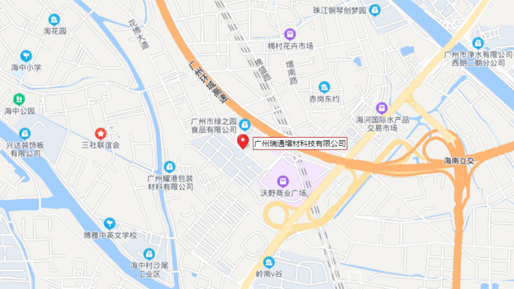

---

# Примечания переводчика

Оригинал — англоязычная редакция руководства (исходный файл называется `M-150说明书（英）`), то есть сам английский текст является переводом с китайского, выполненным машинно и без редактуры. В нём много искажённых терминов и оборванных фраз. Перевод выполнен по смыслу, с восстановлением исходной технической терминологии; ниже перечислено, что именно было восстановлено, и какие противоречия остались в самом оригинале.

## Восстановленные термины

| В английском оригинале | Что это на самом деле | В переводе |
|---|---|---|
| «shop paint», «shop powder», «the shop» | 铺粉器 / 铺粉 — устройство нанесения порошка | ракель, нанесение порошка |
| «Put a seal on» (заголовок п. 5) | 正式打印 — переход к собственно печати | «Запуск печати» |
| «Power continued» (заголовок п. 6) | 断电续打 — продолжение печати после сбоя питания | «Возобновление печати после отключения питания» |
| «Incoming operation» / «Out operation» | 进机 / 出机 — загрузка и выгрузка | «Загрузка и подготовка к печати» / «Выгрузка после печати» |
| «molding warehouse», «forming warehouse» | 成型仓 — камера построения | камера построения |
| «vibrator», «vibration lens» | 振镜 — гальванометрический сканатор | сканатор |
| «deaeration cycle purification system» | 除气循环净化系统 | система циркуляции и очистки защитного газа |
| «Finish Size» | 成型尺寸 | размер зоны построения |
| «Service Rating» | потребляемая мощность | потребляемая мощность |
| «Host» | 主机 | основной блок |
| «trachea» (дословно «трахея») | 气管 — пневматический шланг | пневматический шланг |
| «bracket», «stent» | 支架 — бюгельный каркас (съёмный протез) | бюгельный каркас |
| «typesetting» | 排版 — раскладка деталей на платформе | раскладка |
| «Mixing plate» | выравнивание подложки по уровню порошка | «Выровняйте подложку по уровню порошка» |
| «VoxelDance AddiDve» | опечатка вместо VoxelDance Additive; в оглавлении — «ADDI D VE» | VoxelDance Additive |
| «Automturn off» | обрыв слова: automatically turn off | «автоматически гаснет» |

## Противоречия и недочёты, оставшиеся в оригинале

| № | Место | Что не сходится |
|---|---|---|
| 1 | п. 2.2.2, шаг «а» | Сказано открыть «платформу устройства **D-150**», хотя всё руководство описывает модель **M-150**. Вероятно, фрагмент перенесён из руководства другой модели. |
| 2 | п. 3.1, еженедельное обслуживание | В строке про направляющую каретки ракеля указано «только для моделей **D-120, D-280**» — то есть пункт не относится к M-150, но оставлен в таблице. |
| 3 | п. 1.2 и п. 2.2.2 | Производительность заявлена как «200 коронок или **14** бюгельных каркасов за 4,5 часа», а в разделе раскладки сказано, что на платформе размещается **15–17** каркасов. |
| 4 | п. 3.2, внешняя циркуляция | Клапан сброса обозначен то как **Q3** (в тексте), то как **C3** (в блок-схеме). Шаровой кран **Q1** описан одновременно и как кран наддува бака, и как кран промывки порошкового бака. |
| 5 | п. 1.1 | Про систему циркуляции сказано «включает четыре части» и в базовом, и в титановом исполнении, хотя перечни различаются составом (1 или 2 газоанализатора, встроенный или выносной фильтр). |
| 6 | п. 3.2 | Даны ссылки на «приложение 1», «приложение 2» и «приложение 3» (оснастка для обслуживания, порядок применения огнетушителей), но самих приложений в руководстве нет — их следует запросить у изготовителя. |
| 7 | п. 2.2.1, шаг 4 | Фраза про замену уплотнительного кольца в оригинале оборвана и не образует законченного указания; переведена максимально близко к тексту. |

## Замечания по оформлению

- **Скриншоты оставлены без изменений.** Интерфейс программ 3DPrint и VoxelDance Additive — RITON DENTAL англоязычный, локализованной версии нет, поэтому надписи на снимках экрана соответствуют тому, что оператор видит на самом деле. Подписи под иллюстрациями и описания элементов интерфейса переведены на русский.
- **Названия элементов интерфейса** в тексте приведены в кавычках на языке программы с переводом в скобках — так их можно найти на экране.
- **Страницы 47–52 оригинала** (линованные листы для заметок) в перевод не включены, поскольку не содержат текста.
- **Формат RTP** — собственный формат управляющих файлов печати установки; в оригинале записан как «rtp format file».
