# РУКОВОДСТВО ПО ЭКСПЛУАТАЦИИ (МЕХАНИЧЕСКАЯ ЧАСТЬ)

## Портальный обрабатывающий центр SF4030T-5S

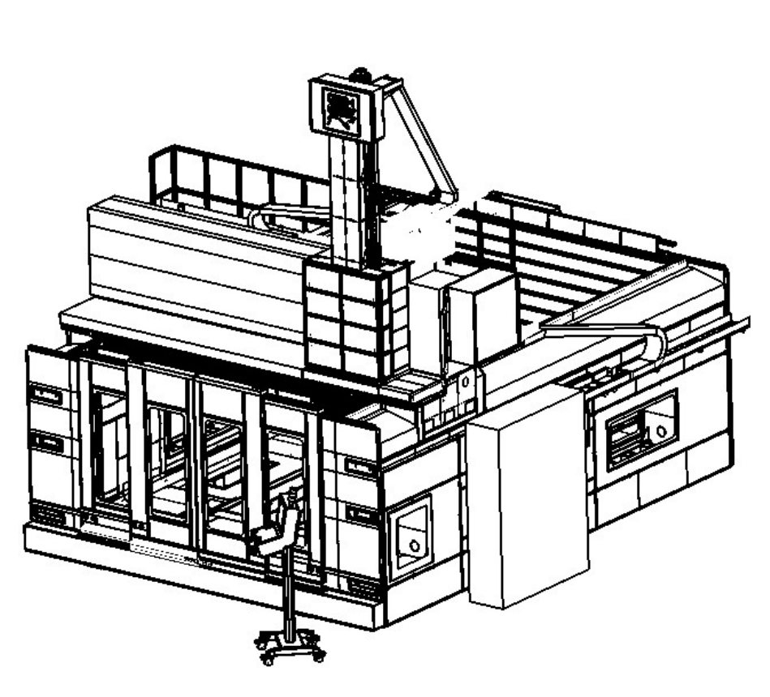

**Изготовитель:** Shandong Chencan Machinery Equipment Co., Ltd. (晨灿机械 / CHENcan machine)

> Изображение на обложке приведено только для справки; фактическое исполнение определяется поставленным изделием.

---

## Предисловие

Уважаемый пользователь!

Благодарим Вас за доверие к компании Chencan Machinery и выбор нашей продукции. Мы рассчитываем обеспечить Вам рост экономической эффективности за счёт высокого качества изделий и сервиса.

Перед первым использованием станка внимательно прочитайте настоящее руководство и соблюдайте изложенные в нём требования. Это поможет Вам лучше понять станок и правильно его эксплуатировать, обеспечит его исправную работу и сохранение оптимальных характеристик в течение всего срока службы.

Если в процессе эксплуатации Вы обнаружите какие-либо неисправности, своевременно свяжитесь со специалистами службы послепродажного обслуживания нашей компании — они окажут Вам качественную помощь по ремонту и техническому обслуживанию. Обязательно эксплуатируйте и обслуживайте станок в соответствии с указаниями настоящего руководства.

Настоящее руководство содержит сведения о станках нескольких исполнений. Вследствие различий в комплектации описания в руководстве могут отличаться от фактической конфигурации приобретённого Вами станка; в этом случае следует руководствоваться фактически полученным оборудованием.

Все сведения, приведённые в руководстве, актуальны на момент публикации и могут быть изменены без предварительного уведомления.

---

## Предупреждения

> ### ⚠ [ВНИМАНИЕ] / [ПРЕДУПРЕЖДЕНИЕ]
>
> Данный знак обозначает особо важные указания. Перед эксплуатацией станка внимательно изучите настоящее руководство. Запрещается работа на оборудовании лицами, не прошедшими соответствующего обучения и не имеющими допуска, — во избежание возникновения опасных ситуаций и несчастных случаев.
>
> Настоящий станок представляет собой портальный обрабатывающий центр, предназначенный **исключительно для обработки неметаллических материалов**: он может применяться только для обработки древесины, пенополистирола и других неметаллических материалов. **Запрещается** обработка таких материалов, как твёрдые металлы, магниевые сплавы, графит и т. п.

Станок оснащён многочисленными средствами обеспечения безопасности, предотвращающими травмирование персонала и повреждение оборудования. Любое лицо, приступающее к эксплуатации или обслуживанию станка, обязано внимательно изучить настоящее руководство.

*Все права защищены. Без письменного согласия Shandong Chencan Machinery Equipment Co., Ltd. запрещается перепечатка или копирование любой части настоящего руководства.*

---

## Содержание

1. [Указания по технике безопасности](#1-указания-по-технике-безопасности)
   - 1.1 [Общие правила безопасности](#11-общие-правила-безопасности)
   - 1.2 [Безопасность перед пуском](#12-безопасность-перед-пуском)
   - 1.3 [Проверки безопасности при пуске](#13-проверки-безопасности-при-пуске)
   - 1.4 [Безопасность при работе станка](#14-безопасность-при-работе-станка)
   - 1.5 [Безопасность по окончании работы](#15-безопасность-по-окончании-работы)
   - 1.6 [Безопасность при ремонтных работах](#16-безопасность-при-ремонтных-работах)
   - 1.7 [Требования к условиям окружающей среды](#17-требования-к-условиям-окружающей-среды)
   - 1.8 [Предупреждающие таблички](#18-предупреждающие-таблички)
2. [Технические характеристики](#2-технические-характеристики)
   - 2.1 [Технические параметры станка](#21-технические-параметры-станка)
3. [Краткое описание конструкции станка](#3-краткое-описание-конструкции-станка)
   - 3.1 [Основные узлы станка](#31-основные-узлы-станка)
   - 3.2 [Система координат станка](#32-система-координат-станка)
   - 3.3 [Система подач](#33-система-подач)
   - 3.4 [Требования к шпиндельной головке и инструменту](#34-требования-к-шпиндельной-головке-и-инструменту)
   - 3.5 [Ось X](#35-ось-x)
   - 3.6 [Ось Y](#36-ось-y)
   - 3.7 [Ось Z](#37-ось-z)
4. [Описание функциональных систем](#4-описание-функциональных-систем)
   - 4.1 [Пневматическая система](#41-пневматическая-система)
   - 4.2 [Система охлаждения зоны обработки](#42-система-охлаждения-зоны-обработки)
5. [Транспортирование и монтаж станка](#5-транспортирование-и-монтаж-станка)
   - 5.1 [Подъём и транспортирование](#51-подъём-и-транспортирование)
   - 5.2 [Монтаж станка](#52-монтаж-станка)
6. [Обкатка](#6-обкатка)
   - 6.1 [Обкатка шпиндельной бабки](#61-обкатка-шпиндельной-бабки)
   - 6.2 [Обкатка системы подач](#62-обкатка-системы-подач)
7. [Техническое обслуживание станка](#7-техническое-обслуживание-станка)
   - 7.1 [Периодическое техническое обслуживание](#71-периодическое-техническое-обслуживание)

---

# 1. Указания по технике безопасности

Перед началом работы на станке и перед проведением текущего технического обслуживания оператор обязан внимательно изучить настоящее руководство, чтобы ознакомиться с мерами и требованиями безопасности, относящимися к данному станку, и соблюдать соответствующие меры предосторожности.

## 1.1 Общие правила безопасности

> ⚠ **ПРЕДУПРЕЖДЕНИЕ.** Несоблюдение общих правил безопасности может привести к травмированию персонала или повреждению станка.

**1.1.1** Не прикасайтесь к каким-либо выключателям мокрыми руками — это опасно поражением электрическим током. На приводных двигателях трёх осей станка, двигателе магазина инструмента, шкафу трансформатора и дверях электрошкафа нанесены знаки молнии, указывающие на наличие в этих местах высоковольтных электроприборов или электрических компонентов. При приближении к этим местам, а также при их вскрытии для обслуживания оператор должен соблюдать особую осторожность во избежание поражения электрическим током.

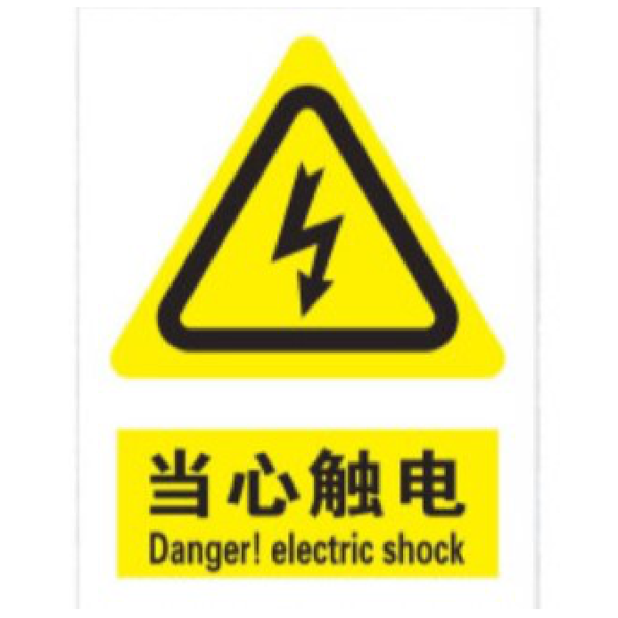

**1.1.2** Необходимо хорошо знать расположение кнопки аварийного останова. На пульте управления имеется кнопка аварийного останова с красной грибовидной головкой. При случайном столкновении узлов или в иной аварийной ситуации следует немедленно нажать эту кнопку: питание будет отключено, станок мгновенно остановится, что позволит избежать более серьёзных повреждений.

**1.1.3** Полностью прочитайте руководство по эксплуатации станка, чтобы освоить все его функции и приёмы работы.

**1.1.4** Не нажимайте произвольно кнопки управления и путевые (конечные) выключатели. Не изменяйте положение конечных выключателей. **Без согласования с заводом-изготовителем запрещается самовольно регулировать зацепление зубчатой шестерни с рейкой**, поскольку это влияет на точность привода.

**1.1.5** Не открывайте без необходимости двери электрошкафа; запрещается изменять установленные параметры станка, настройки потенциометров и таймеров. Если изменение всё же необходимо, оно должно выполняться прошедшим обучение и допущенным заводом-изготовителем специалистом, при этом значения параметров до изменения должны быть записаны, чтобы при необходимости можно было восстановить исходное состояние.

**1.1.6** При внезапном исчезновении напряжения питания следует немедленно отключить вводной выключатель электрошкафа.

**1.1.7** Запрещается прикасаться к устройству ЧПУ, сервоприводам, трансформатору, вентиляторам и другим находящимся под напряжением компонентам внутри электрошкафа при включённом питании.

> ⚠ **ПРЕДУПРЕЖДЕНИЕ.** В электрошкафу имеются высоковольтные части (обозначенные знаком молнии). Не прикасайтесь к ним — это опасно тяжёлым поражением электрическим током. Прикосновение к клеммам также сопряжено с опасностью поражения током.

**1.1.8** Транспортирование и подъём станка должны выполняться в соответствии с требованиями раздела 5 настоящего руководства.

## 1.2 Безопасность перед пуском

**1.2.1** Кабельная линия между цеховым источником питания и станком должна иметь достаточную длину и защитную оболочку; соединения должны быть надёжными, следует исключить возможность повреждения кабеля.

**1.2.2** Уточните требования станка по напряжению, току и коммутационной способности аппарата защиты. Напряжение питания станка — трёхфазное 380 В, 50 Гц; ток при полной нагрузке — 203,17 А. Допустимый диапазон отклонения напряжения питания: 380 В (±10 %). Если напряжение сети пользователя не соответствует требованиям, рекомендуется установить стабилизатор напряжения, иначе длительная эксплуатация приведёт к повреждению электрооборудования станка.

**1.2.3** После распаковки (по завершении дальней перевозки) необходимо в первую очередь проверить целостность транспортных крепёжных приспособлений.

**1.2.4** Перед пуском станка необходимо убедиться, что транспортные фиксирующие кронштейны и крепёжные винты по осям X, Y и Z полностью сняты.

**1.2.5** Во время работы и по её окончании двери и крышки электрооборудования должны быть закрыты, чтобы предотвратить попадание воды, пыли и агрессивных газов в устройство ЧПУ, на плату управления питанием пульта (операторской станции) и в другие узлы.

**1.2.6** Убедитесь, что в мультипликаторе (цилиндре отжима инструмента), баке станции смазки и в холодильной машине имеются масло/жидкость требуемой марки и что уровень жидкости находится в пределах установленных меток.

**1.2.7** Убедитесь, что давление в цеховой магистрали сжатого воздуха не ниже 0,6 МПа; рабочее давление блока подготовки воздуха — 0,6 МПа.

**1.2.8** Проверьте отсутствие посторонних предметов на всех узлах станка; конус шпинделя должен быть чистым. Проверьте, нет ли ослабленных или отсоединившихся трубопроводов и проводов; при обнаружении — немедленно устраните. Подавать питание разрешается только после завершения очистки, полной проверки готовности всех узлов станка и подтверждения безопасности.

**1.2.9** Подачу питания следует выполнять в такой последовательности: цеховой вводной выключатель → автоматический выключатель главной цепи станка → выключатель пуска станка на пульте управления.

**1.2.10** Ключи от электрошкафа станка, шкафа трансформатора и замка клавиатуры должны использоваться только для данного станка; замена ключей и их использование одновременно на нескольких станках не допускаются — это приводит к повреждению замков и затрудняет эксплуатацию.

## 1.3 Проверки безопасности при пуске

> ⚠ **ПРЕДУПРЕЖДЕНИЕ.** Перед подачей питания на станок проверьте наличие заземления цехового питающего кабеля, подводимого к станку. Отсутствие заземления приведёт к повреждению электрооборудования станка.

**1.3.1** После включения выключателя пульта управления в первую очередь проверьте правильность состояния индикаторов на приводах всех осей.

**1.3.2** Проверьте, нет ли на дисплее аварийных сообщений какого-либо типа.

**1.3.3** Проверьте все электродвигатели и другие движущиеся части на отсутствие посторонних шумов.

**1.3.4** Проверьте правильность положения останова магазина инструмента.

**1.3.5** Проверьте правильность направления вращения электродвигателей всех узлов. Направление вращения двигателя насоса системы охлаждения должно соответствовать указателю на корпусе насоса.

При выявлении отклонений по любому из перечисленных пунктов их необходимо своевременно устранить; только после этого допускается продолжение работ.

## 1.4 Безопасность при работе станка

**1.4.1** Перед началом работы выполните калибровку осей станка (выход в ноль), чтобы координаты всех осей вернулись в точку привязки станка.

**1.4.2** В начале работы прогрейте станок: частота вращения шпинделя повышается ступенчато от низкой к высокой (4–5 ступеней), каждая ось перемещается на величину, близкую к полному ходу, со скоростью 1/3 от максимальной. Продолжительность прогрева — примерно 10–20 минут.

**1.4.3** Перед запуском новой управляющей программы рекомендуется заблокировать оси станка и один раз прогнать программу «вхолостую» в системе, чтобы проверить правильность её внутренней логики. Для реальной отработки выберите на пульте режим покадровой отработки; скорость вращения шпинделя и скорости перемещения по координатным осям регулируются переключателями коррекции (override), программа выполняется построчно.

**1.4.4** Применяемый инструмент должен соответствовать требованиям данного станка. Не используйте изношенный или повреждённый инструмент. Убедитесь в надёжности и прочности соединения инструментальной оправки и вспомогательной оснастки. На станке применяется стандартная оправка **HSK 63F**; пользователю категорически запрещается её заменять на другой тип — недостаточная точность или прочность может привести к аварии.

**1.4.5** Не работайте на станке в перчатках — это может привести к ошибочным действиям.

**1.4.6** Регулировка расхода или направления сопла системы охлаждения выполняется только при остановленном станке.

**1.4.7** Запрещается одновременная работа двух и более человек на пульте управления; запрещается управлять станком мокрыми руками.

**1.4.8** При нормальной работе станка запрещается открывать защитные ограждения — во избежание травмирования разлетающимися частицами заготовки или инструмента.

**1.4.9** Во время работы станка запрещается убирать стружку; приступать к уборке разрешается только после полной остановки шпинделя и всех координатных осей.

## 1.5 Безопасность по окончании работы

**1.5.1** По окончании работы инструмент должен быть снят со шпинделя. Конус шпинделя и конусы всех оправок необходимо протереть, чтобы остатки стружки не влияли на качество сопряжения инструмента со шпинделем и на точность вращения инструмента.

> ⚠ **ВНИМАНИЕ.** Запрещается продувать конус шпинделя пневмопистолетом: поток воздуха занесёт мелкие частицы и стружку внутрь конуса шпинделя, что ухудшит его чистоту.

**1.5.2** Перед выключением станка убедитесь, что траверса выведена в переднее положение, каретка (салазки) — в правое, а шпиндельная бабка находится в верхнем безопасном положении. Это предотвращает аварийные столкновения при последующем включении, вызванные неправильной эксплуатацией или обслуживанием.

**1.5.3** По окончании работы своевременно удалите остатки стружки и протрите станок. При большом объёме снимаемого материала стружку следует убирать в технологических перерывах. Если для уборки стружки применяется пневмопистолет, в шпинделе обязательно должен быть установлен инструмент, чтобы стружка и посторонние частицы не были задуты в конус шпинделя. После уборки выполните действия по п. 1.5.1.

**1.5.4** Ежедневно проверяйте уровень охлаждающей жидкости и смазочного материала, при необходимости доливайте охлаждающую жидкость и смазочное масло. Ежедневное обслуживание станка должно соответствовать типовым требованиям ежесменного обслуживания.

**1.5.5** Выключение выполняется в следующем порядке: выключатель питания на пульте управления → выключатель главной цепи станка → цеховой вводной выключатель.

## 1.6 Безопасность при ремонтных работах

**1.6.1** Работы по механическому и электрическому ремонту должны выполняться прошедшими обучение и аттестованными специалистами соответствующего профиля.

**1.6.2** Проведение ремонта под напряжением опасно; как правило, на время ремонтных работ выключатель главной цепи станка должен быть отключён.

> ⚠ **ПРЕДУПРЕЖДЕНИЕ.** После снятия напряжения выждите некоторое время (не менее 5 минут), прежде чем прикасаться к клеммам, так как в течение некоторого времени после отключения на клеммах силовых линий сохраняется высокое напряжение. Во избежание поражения электрическим током не прикасайтесь к ним сразу.

**1.6.3** Запрещается изменять положение конечных выключателей и бесконтактных датчиков.

## 1.7 Требования к условиям окружающей среды

Рабочая среда станка должна исключать вибрацию и другие вредные воздействия; станок следует размещать вдали от источников магнитных полей, горнодобывающих районов, сейсмоопасных зон и т. п. Предпочтительно устанавливать станок в цехе с кондиционированием или термостатированием и со стабильным грунтовым основанием. Сварочные аппараты в цехе должны находиться на расстоянии не менее 20 м от электрошкафа и не должны запитываться от общей со станком сети. Температура рабочей среды: от −10 °C до +40 °C, при этом среднесуточная температура не должна превышать 35 °C; относительная влажность — в диапазоне 30–80 % (без образования конденсата). Как правило, станок должен эксплуатироваться на высоте не более 1000 м над уровнем моря.

Условия транспортирования и хранения станка должны исключать попадание дождя, повышенную влажность, наклонное положение, повреждение грызунами, размещение в низинах и т. п., а также обеспечивать хорошую вентиляцию. Температура при транспортировании и хранении: от −10 °C до +40 °C, относительная влажность — не более 80 %. При транспортировании и хранении продолжительностью не более 24 часов допускается температура окружающей среды до 70 °C. Запрещается длительное хранение под открытым небом. Если по каким-либо причинам требуется временное хранение, то, помимо выполнения вышеуказанных требований, необходимо постоянно контролировать состояние места хранения и упаковки, чтобы не допустить повреждения станка.

## 1.8 Предупреждающие таблички

> ※ На станке размещены подробные предупреждающие таблички по технике безопасности; операторам следует уделять им особое внимание во избежание возникновения опасных ситуаций ※

> ⚠ Операторы и обслуживающий персонал обязаны эксплуатировать и обслуживать станок в соответствии с указаниями предупреждающих табличек, в противном случае возможны травмирование персонала или повреждение станка!

> ⚠ В процессе эксплуатации и обслуживания станка не срывайте и не изменяйте произвольно предупреждающие таблички; следите за тем, чтобы таблички находились на своих местах, а надписи оставались разборчивыми. Несоблюдение этого требования может привести к травмированию персонала или повреждению станка!

### Табличка на шпинделе

Размещается на передней панели листовой обшивки шпиндельной головки. Содержит меры предосторожности при работе с пневмопистолетом, меры личной безопасности при вращении шпинделя и т. п.

Содержание табличек:

- **⚠ ПРЕДУПРЕЖДЕНИЕ:** Запрещается направлять струю воздуха непосредственно на шпиндель для его очистки. Это может привести к попаданию стружки или СОЖ в подшипники шпинделя и к выходу шпинделя из строя.
- **⚠ ПРЕДУПРЕЖДЕНИЕ:** Запрещается приближаться к шпинделю во время его вращения.

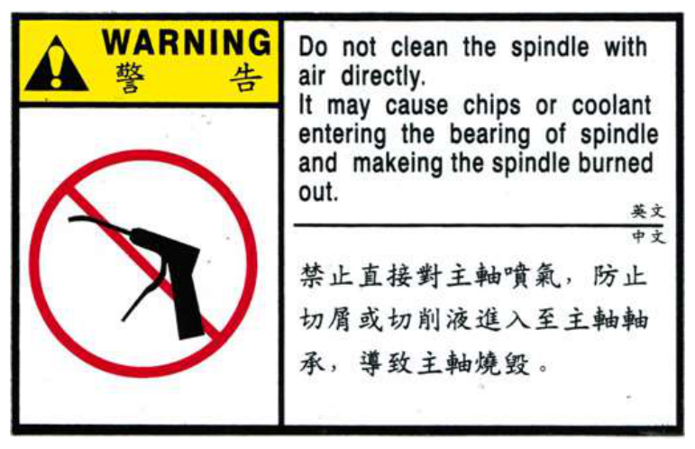

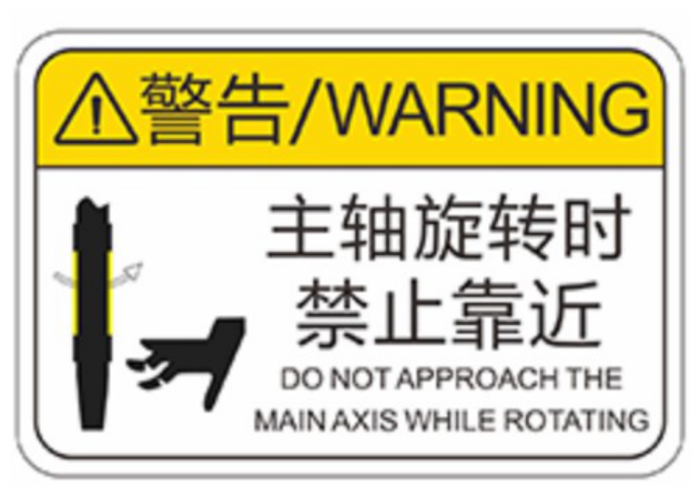

### Табличка по безопасному прогреву станка

Размещается на боковой стенке шкафа управления. Содержит указания по прогреву, требования безопасности и ряд особых предупреждений; внимательно ознакомьтесь с ней.

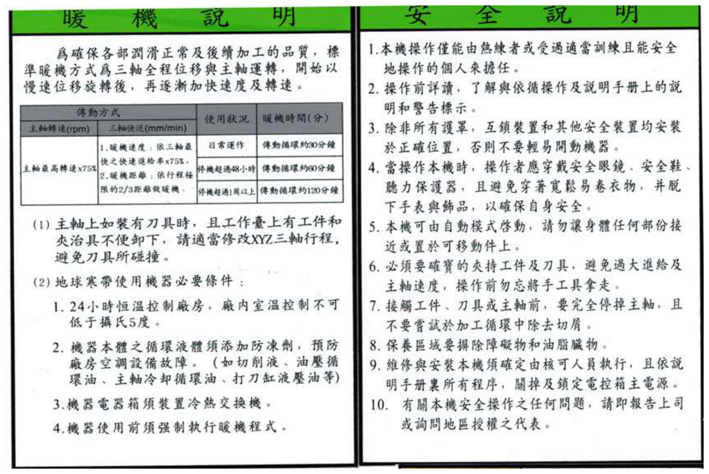

**Указания по прогреву станка**

Для обеспечения нормальной смазки всех узлов и качества последующей обработки стандартная процедура прогрева предусматривает перемещение трёх осей на полную длину хода и вращение шпинделя: сначала на малой скорости перемещения и малой частоте вращения, затем с постепенным увеличением скорости и частоты вращения.

| Режим прогрева: частота вращения шпинделя, об/мин | Режим прогрева: скорость быстрых перемещений по трём осям, мм/мин | Условия эксплуатации | Время прогрева, мин |
|---|---|---|---|
| Макс. частота вращения шпинделя × 75 % | 1. Скорость прогрева: 75 % от максимальной скорости быстрого хода по трём осям. 2. Длина хода при прогреве: перемещение на 2/3 предельной длины хода | Повседневная работа | Цикл перемещений ок. 30 мин |
| — | — | Простой более 48 часов | Цикл перемещений ок. 60 мин |
| — | — | Простой более 1 недели | Цикл перемещений ок. 120 мин |

1. Если в шпинделе установлен инструмент, а на рабочем столе находятся заготовка и приспособления, снятие которых затруднительно, соответствующим образом ограничьте длину хода по осям X, Y, Z во избежание столкновения инструмента.
2. Обязательные условия эксплуатации станка в холодном климате:
   1. Круглосуточное термостатирование цеха; температура в помещении не должна опускаться ниже +5 °C.
   2. В циркулирующие жидкости станка необходимо добавить антифриз для предотвращения последствий отказа системы кондиционирования цеха (СОЖ, циркуляционное масло гидросистемы, масло контура охлаждения шпинделя, гидравлическое масло цилиндра отжима инструмента и т. п.).
   3. Электрошкаф станка должен быть оснащён теплообменником (кондиционером).
   4. Перед началом эксплуатации станка обязательно выполняется процедура прогрева.

**Указания по технике безопасности (табличка)**

1. Работа на станке допускается только для опытных лиц либо лиц, прошедших надлежащее обучение и способных работать безопасно.
2. Перед началом работы внимательно изучите руководство и следуйте указаниям и предупреждающим знакам, приведённым в нём.
3. Не запускайте станок, пока все ограждения, блокировки и прочие защитные устройства не установлены в правильное положение.
4. При работе на станке оператор должен использовать защитные очки, защитную обувь и средства защиты органов слуха, избегать свободной, легко затягиваемой одежды, а также снять наручные часы и украшения для обеспечения собственной безопасности.
5. Станок может запускаться в автоматическом режиме — не приближайте и не размещайте какие-либо части тела на подвижных элементах.
6. Заготовка и инструмент должны быть надёжно закреплены; избегайте чрезмерных подач и частот вращения шпинделя; перед пуском не забудьте убрать ручной инструмент.
7. Перед прикосновением к заготовке, инструменту или шпинделю полностью остановите шпиндель; не пытайтесь удалять стружку во время цикла обработки.
8. В зоне обслуживания не должно быть посторонних предметов и масляных загрязнений.
9. Ремонт и монтаж станка должны выполняться только допущенным персоналом с соблюдением всех процедур, изложенных в руководстве, при отключённом и заблокированном главном питании электрошкафа.
10. При любых вопросах, касающихся безопасной эксплуатации станка, немедленно сообщите руководителю или обратитесь к уполномоченному представителю в вашем регионе.

### Табличка «Электропитание»

Опасность поражения электрическим током: соблюдайте осторожность при работе.

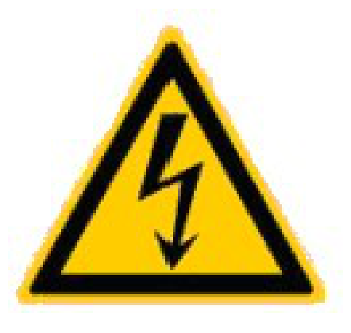

### Табличка «Смазка»

Напоминает оператору о необходимости следить за состоянием смазки станка.

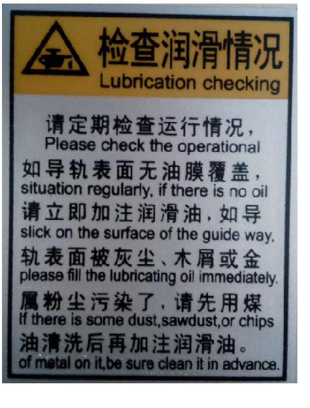

Содержание таблички: *Регулярно проверяйте состояние в процессе работы. Если на поверхности направляющих отсутствует масляная плёнка, немедленно добавьте смазочное масло. Если поверхность направляющих загрязнена пылью, древесной или металлической стружкой, сначала очистите её, а затем нанесите смазочное масло.*

### Таблички направлений перемещений

Размещаются на видных местах станка и обозначают направления по каждой из осей (X −/+, Y +/−, Z +/−).

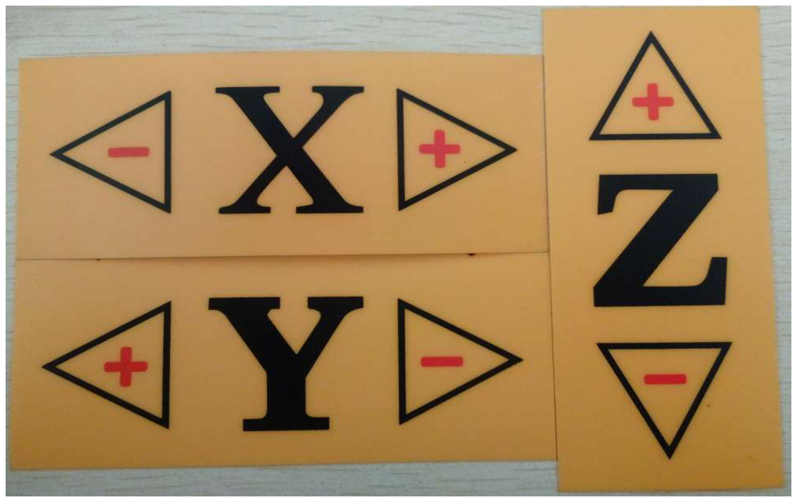

### Таблички ограничения доступа

Размещаются на дверях электрошкафа, шкафа управления и шкафа трансформатора.

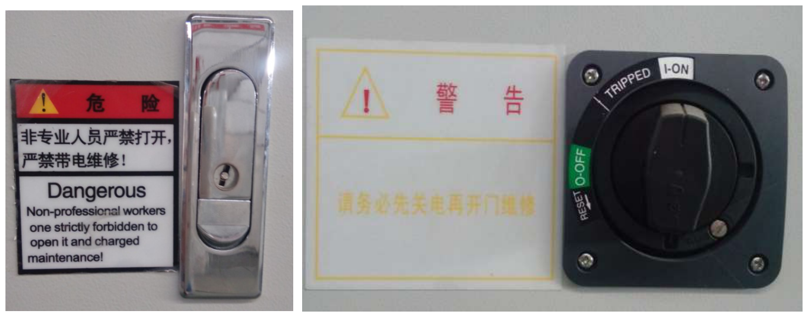

### Знак защитного заземления

Оборудование должно быть надёжно заземлено.

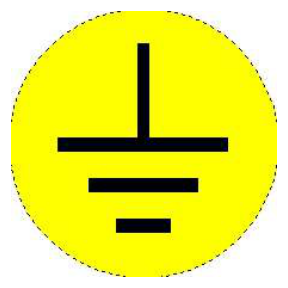

### Знак аварийного останова

В аварийной ситуации нажмите кнопку аварийного останова.

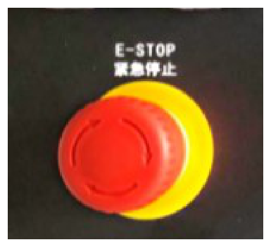

### Знак опасности

Запрещается прикасаться руками.

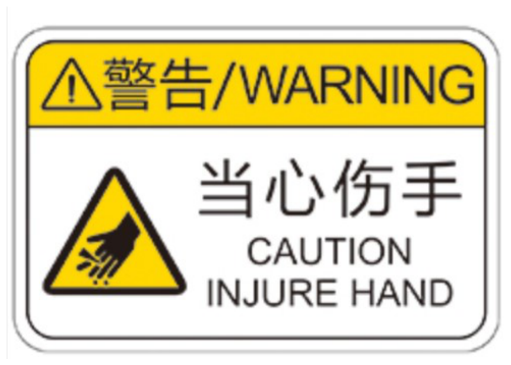

---

# 2. Технические характеристики

## 2.1 Технические параметры станка

| Наименование параметра | | Ед. изм. | SF4030T-5S |
|---|---|---|---|
| **Величина хода** | | | |
| Трёхосевая обработка | ход по оси X | мм | 4000 |
| | ход по оси Y | мм | 3000 |
| | ход по оси Z | мм | 1500 |
| Пятиосевая обработка | ход по оси X | мм | 3000 |
| | ход по оси Y | мм | 2000 |
| | ход по оси Z | мм | 1100 |
| | ось A | — | ±120° |
| | ось C | — | ±360° |
| **Шпиндельная головка** | | | |
| Шпиндель | тип оправки (хвостовика) | — | HSK-63F |
| | мощность S1/S6 | кВт | 15/17 |
| | максимальная частота вращения | об/мин | 24 000 |
| | крутящий момент S1/S6 | Н·м | 11,9/13,8 |
| | способ охлаждения | — | водяное охлаждение |
| | длина инструмента | мм | 250 |
| | масса инструмента | кг | 5 |
| Ось A | угол поворота | — | ±120° |
| | точность позиционирования | — | ±30 угл. с |
| | повторяемость | — | ±15 угл. с |
| Ось C | угол поворота | — | ±360° |
| | точность позиционирования | — | ±30 угл. с |
| | повторяемость | — | ±15 угл. с |
| **Подачи** | | | |
| | рабочая подача (резание) | м/мин | 0–20 |
| | скорость быстрых перемещений | м/мин | X: 45; Y: 45; Z: 20 |
| **Прочее** | | | |
| | требуемое давление воздуха | кгс/см² | 6,5 |
| | суммарная установленная мощность | кВт | 57 |
| | масса станка | кг | ок. 30 000 |
| | занимаемая площадь (длина × ширина) | мм | 11 500 × 6400 |
| | высота станка | мм | 5540 |

---

# 3. Краткое описание конструкции станка

## 3.1 Основные узлы станка

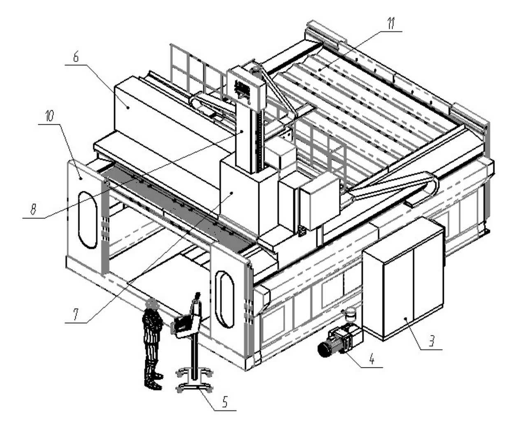

Основной корпус станка состоит из следующих узлов:

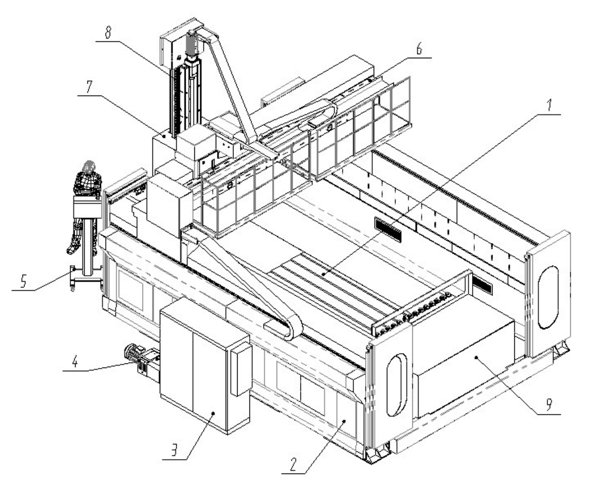

1. рабочий стол;
2. стойки (колонны);
3. шкаф электроавтоматики;
4. вакуумный насос;
5. пульт управления;
6. траверса оси Y;
7. салазки (каретка) оси Y;
8. салазки оси Z;
9. магазин инструмента;
10. листовая обшивка (кожухи);
11. верхнее перекрытие (навес)
    и другие элементы.

Станок в целом выполнен по портальной рамной схеме высокой жёсткости. Рабочий стол, стойки и продольные балки оси X являются неподвижными; боковые плиты и траверса оси Y перемещаются по балкам оси X вперёд-назад (движение по оси X); каретка перемещается по траверсе оси Y влево-вправо (движение по оси Y); салазки оси Z перемещаются в каретке вверх-вниз (движение по оси Z); пятиосевая головка установлена на нижнем конце салазок оси Z и обеспечивает согласованное вращение по осям A и C. Компоновка станка рациональна, внешний вид эстетичен, эксплуатация удобна. Конструкция, рассчитанная на полную длину хода, повышает жёсткость корпуса и эффективно подавляет вибрации, возникающие при обработке.

## 3.2 Система координат станка

Как показано на схеме, оси станка именуются по направлениям перемещения траверсы и шпинделя:

- **Ось X** — перемещение траверсы вперёд/назад;
- **Ось Y** — перемещение каретки (салазок) влево/вправо;
- **Ось Z** — вертикальное перемещение шпинделя вверх/вниз;
- **Ось A** — поворот шпинделя вокруг оси X;
- **Ось C** — поворот шпиндельной головки вокруг оси Z.

Определение положительного (+) и отрицательного (−) направлений перемещения по осям X, Y, Z, A, C:

| Ось | Положительное направление (+) | Отрицательное направление (−) |
|---|---|---|
| X | траверса перемещается назад | траверса перемещается вперёд |
| Y | каретка перемещается влево | каретка перемещается вправо |
| Z | шпиндель перемещается вверх | шпиндель перемещается вниз |
| A | при виде спереди шпиндель поворачивается влево | при виде спереди шпиндель поворачивается вправо |
| C | при виде сверху — поворот против часовой стрелки | при виде сверху — поворот по часовой стрелке |

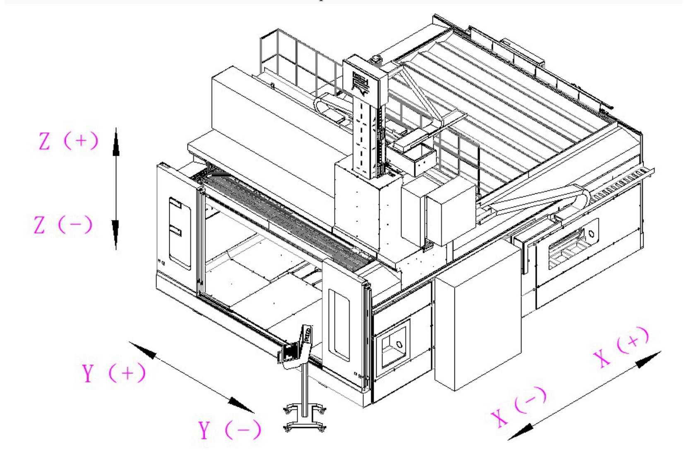

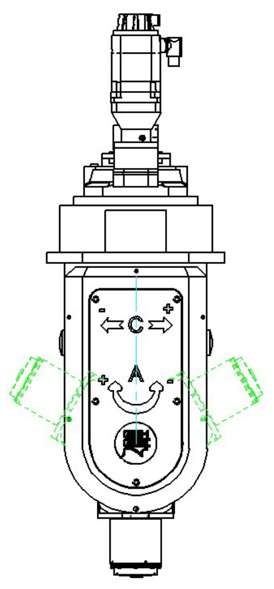

## 3.3 Система подач

Назначение привода подач — принимать команды системы ЧПУ и через сервоусилитель, серводвигатель, синхронный редуктор и винтовую передачу приводить в движение подвижные узлы станка, обеспечивая координатную подачу и позиционирование.

Привод подач по трём осям реализован несколькими группами серводвигателей, работающих через синхронные редукторы; система управляет током двигателей, обеспечивая высокую динамику привода, что повышает жёсткость системы передачи движения и гарантирует точность работы.

Каждая ось оснащена системой смазки, обеспечивающей смазывание кареток и винтовых передач, что гарантирует точность передачи движения и продлевает срок службы узлов.

## 3.4 Требования к шпиндельной головке и инструменту

Высокоточная пятиосевая головка собственного изготовления выполнена на базе моноблочной пятиосевой головки, импортируемой из Италии. Мощность шпинделя — 15/17 кВт (S1/S6), крутящий момент — 11,9/13,8 Н·м (S1/S6). Фрезерная головка имеет две управляемые от ЧПУ поворотные координаты непрерывного вращения — 4-ю ось (ось C) и 5-ю ось (ось A), что позволяет ориентировать инструмент в пространстве произвольным образом и обеспечивать высокоточную обработку под любым углом.

Станок оснащён высокоскоростным электрошпинделем итальянского производства; его внутренние подшипники — износостойкие керамические с полимерным сепаратором. Шпиндель отличается малым радиальным биением и хорошей динамической балансировкой, имеет пожизненную консистентную смазку и не требует обслуживания; он рассчитан на длительную высокоскоростную фрезерную обработку с высокой жёсткостью.

Шпиндель охлаждается интеллектуальной холодильной машиной с внутренней циркуляцией охлаждающей жидкости. Оборудование может непрерывно работать в течение 24 часов в сутки при заданной температуре. Холодильная машина имеет защитные функции: аварийную сигнализацию по уровню жидкости, по низкому давлению и др.

Шпиндель управляется от статического преобразователя частоты с векторным управлением, что позволяет получать большой крутящий момент на валу шпинделя даже при крайне низких частотах.

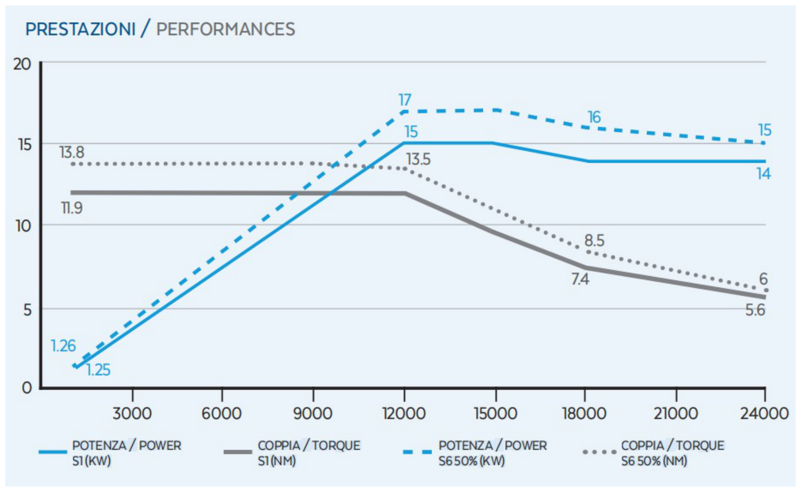

На данном станке применяется инструментальная оправка **HSK-63F**. При использовании оправок иного стандарта соответствующим образом изменяется и механизм зажима инструмента (пользователю необходимо учитывать это при эксплуатации станка и заказе оправок). В процессе разжима инструмента сухой очищенный сжатый воздух подаётся в центральное отверстие тяги и выходит через конус шпинделя, очищая конус шпинделя и конусную поверхность оправки.

> ⚠ **ПРЕДУПРЕЖДЕНИЕ.** На шпинделе данного станка применяется оправка типа **F по DIN 69893**. Запрещается использовать оправки, не соответствующие требуемым размерам; недопустимо также смешанное использование оправок разных типов на станках с различными требованиями — это приведёт к отказу захвата инструмента и повреждению шпинделя либо к иным опасным происшествиям.

**Обозначение оправки:** HSK-63F-ER40-100
(тип конуса — HSK-63F; тип цанги — ER40; вылет/длина — 100 мм)

## 3.5 Ось X

Продольные балки оси X, расположенные с двух сторон станка, представляют собой соединённые между собой балки большого сечения, сваренные из высокопрочного стального листа. Их точность регулируется несколькими установочными (нивелировочными) болтами в основании стоек и регулировочными позиционирующими планками. Боковая плита с каждой стороны приводится собственным серводвигателем; наличие системы смазки обеспечивает точность передачи движения и продлевает срок службы.

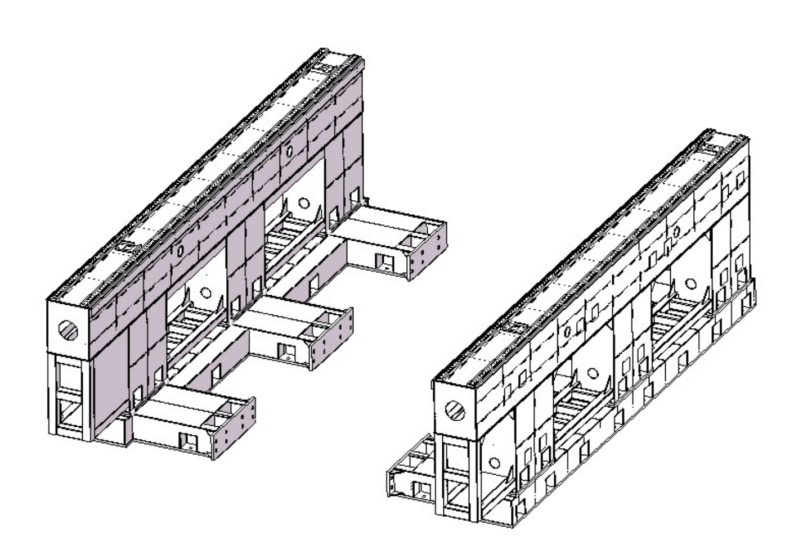

## 3.6 Ось Y

Узел траверсы оси Y состоит в основном из траверсы оси Y, салазок оси Y, электродвигателя оси Y, направляющих оси Y и других элементов. Траверса оси Y изготовлена из специальной стали и имеет перекрёстную сварную конструкцию с элементами точной регулировки, что позволяет избежать погрешностей точности, обусловленных механической обработкой и собственным весом конструкции.

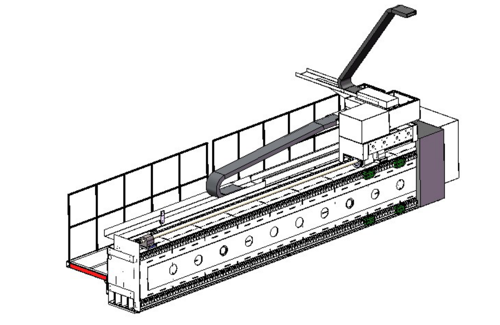

## 3.7 Ось Z

Узел оси Z состоит в основном из салазок оси Z, электродвигателя с редуктором оси Z, направляющих оси Z, винтовой передачи и других элементов. Для обеспечения жёсткости оси Z при сверхбольшой длине хода по левой и правой сторонам салазок Z равномерно расположены роликовые направляющие, что обеспечивает высокую прочность и жёсткость. С задней стороны установлена шарико-винтовая передача с большим шагом, работающая совместно с высокомоментным электродвигателем и редуктором, что делает привод более стабильным.

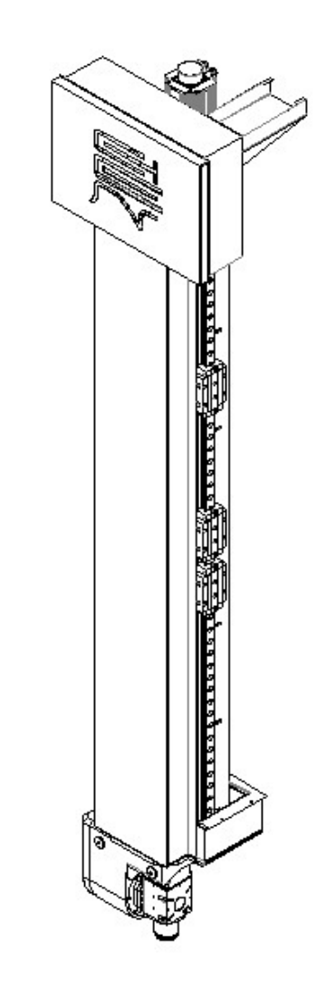

---

# 4. Описание функциональных систем

## 4.1 Пневматическая система

При смене инструмента на станке большинство операций — создание избыточного давления в цилиндре отжима инструмента, обдув через центр шпинделя, работа магазина инструмента и его дверцы — выполняются с пневматическим управлением и приводом. Рабочее давление пневмосистемы — 0,6 МПа; давление сжатого воздуха, подаваемого из цеховой магистрали, должно быть не ниже 0,7 МПа.

**Порядок регулировки давления:** вытяните регулировочную рукоятку редукционного клапана блока подготовки воздуха и медленно поворачивайте её, наблюдая за стрелкой манометра; по достижении требуемого значения давления вдавите рукоятку обратно. Давление должно быть отрегулировано точно: при падении давления ниже 0,4 МПа система управления не сможет продолжать нормальную работу и выдаст предупреждение на пульте оператора. Слишком высокое давление вызывает ударные нагрузки и может привести к преждевременному выходу из строя соответствующих деталей.

**Заправка маслораспылителя (лубрикатора).** В маслораспылитель блока подготовки воздуха заливается турбинное масло 32#. Необходимо регулярно проверять уровень масла и при необходимости доливать его. Порядок заправки и регулировки подачи масла: при перекрытой подаче воздуха вручную нажмите вверх или вбок на клапан слива конденсата в нижней части фильтра, чтобы стравить остаточное давление; затем выверните резьбовую пробку заливного отверстия, расположенного в верхней средней части маслораспылителя, — через это отверстие производится заливка. Уровень масла должен находиться между нижней кромкой прозрачной трубки в масляном стакане и отметкой 8/10 стакана; после заливки все резьбовые пробки необходимо затянуть. В верхней части маслораспылителя расположен регулировочный клапан подачи масла — вращением его настраивают количество смазочного масла, поступающего в расположенные далее пневматические компоненты. Как правило, достаточно отвернуть рукоятку этого клапана из закрытого положения на 1–2 оборота.

**Замена пневмораспределителей.** При утрате работоспособности или повреждении любой распределитель подлежит замене. При этом необходимо следить за правильностью типа и типоразмера клапана; после установки схема электрического подключения должна остаться неизменной. Признаком правильной работы механической части является следующее: после подачи на станок воздуха и включения питания движения станка соответствуют командам, а шпиндель находится в состоянии зажима инструмента либо без инструмента. Перечисленные состояния изменяются при перестановке местами двух воздушных трубок на выходе распределителя, поэтому положение подключения должно быть правильным, а монтаж — строго соответствовать пневматической схеме.

## 4.2 Система охлаждения зоны обработки

В базовой комплектации данная система включает устройство воздушного (обдувного) охлаждения режущего инструмента, расположенное на торце шпинделя. Воздух от источника через клапан управления пневмолинией подаётся к торцу шпинделя и далее через сегментный шланг (типа «бамбук»), установленный на торце шпинделя, вращающийся вместе с инструментом при обработке, — тем самым обеспечивается охлаждение инструмента.

Воздух от источника по трубопроводу подаётся к охлаждающему соплу на торце шпинделя и направляется непосредственно на инструмент и заготовку. Расход воздуха регулируется краном сегментного шланга. В процессе работы расход и направление воздушного потока, выходящего из сопла, необходимо своевременно корректировать при изменении инструмента и режимов резания.

Включение и выключение функции охлаждения выполняется кнопкой на панели системы. Помните: при регулировке направления сопла обязательно остановите вращение шпинделя — во избежание опасности, связанной с вращением инструмента.

---

# 5. Транспортирование и монтаж станка

## 5.1 Подъём и транспортирование

При подъёме и перемещении станка необходимо учитывать его полную массу и положение центра тяжести. Полная масса оборудования составляет около 27 т. Оборудование отгружается в разобранном виде; остальные узлы и детали грузятся и перевозятся раздельно. При использовании любых грузоподъёмных и транспортных средств их грузоподъёмность должна превышать массу поднимаемого узла станка.

Ориентировочные массы узлов:

| Узел | Масса |
|---|---|
| Рабочий стол | ок. 3800 кг |
| Одна балка оси X | ок. 4000 кг |
| Траверса оси Y | ок. 3800 кг |
| Узел оси Z | ок. 1600 кг |
| Одно основание (база) | ок. 3000 кг |

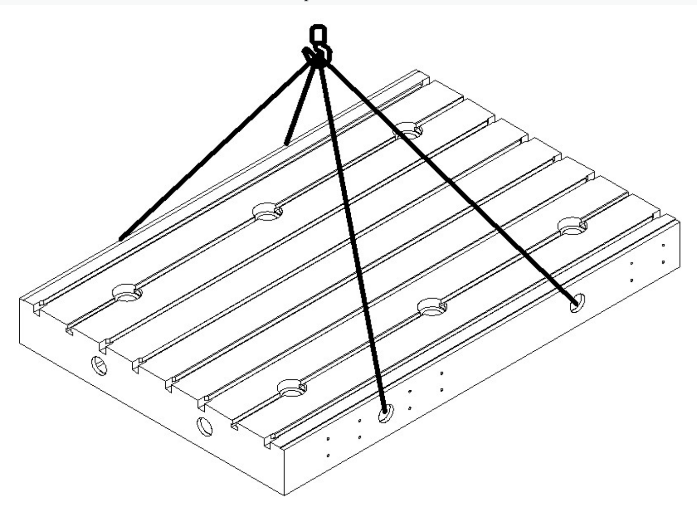

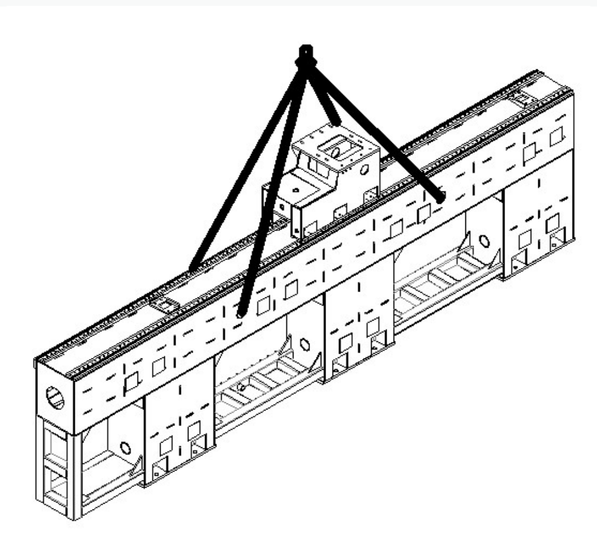

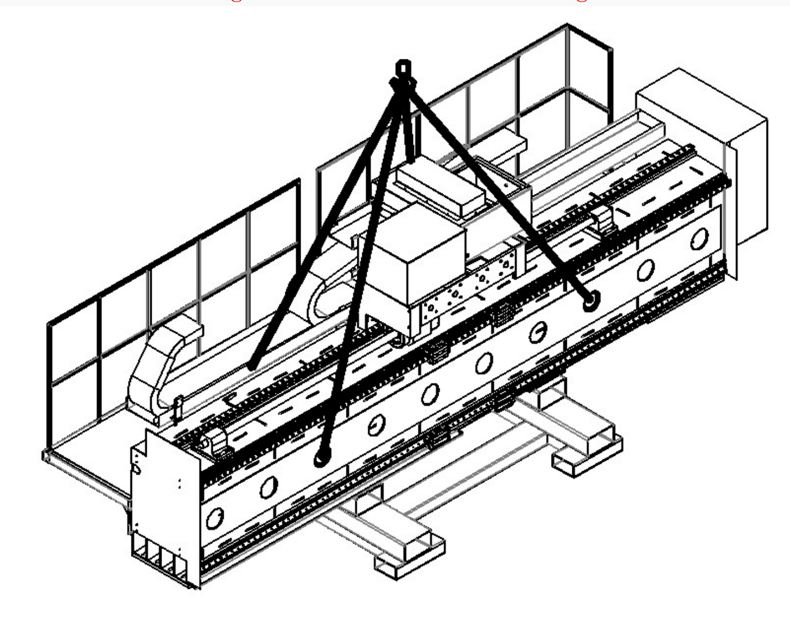

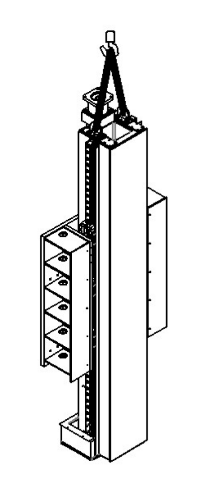

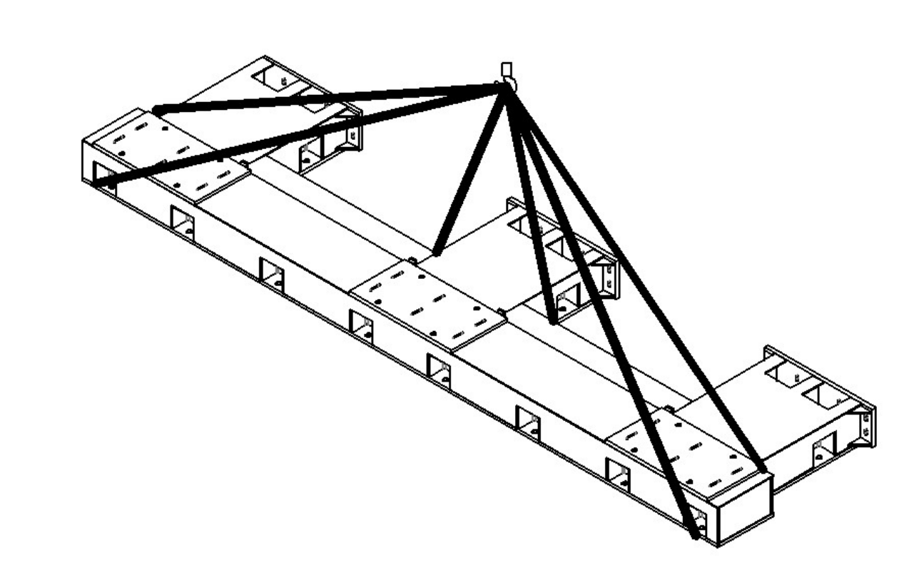

При подъёме обязательно убедитесь в равномерном распределении нагрузки на применяемые грузозахватные приспособления; запрещается произвольно обвязывать станину стропами. Грузоподъёмность одного стропа, применяемого при подъёме, не должна быть меньше массы поднимаемого узла станка; стропы не должны иметь дефектов — обрывов, повреждений и т. п.; применение допускается только после осмотра и подтверждения их безопасности.

> ⚠ **ПРЕДУПРЕЖДЕНИЕ.** Перед подъёмом и перемещением станка подвижные узлы станка должны быть надёжно зафиксированы относительно друг друга.

## 5.2 Монтаж станка

Станок должен устанавливаться на прочном бетонном фундаменте. Толщина фундамента должна строго соответствовать чертежу фундамента, а его несущая способность — быть не ниже требований к оборудованию; станок фиксируется установочными (анкерными) элементами. При монтаже с помощью контрольно-измерительных инструментов выполняется выверка станка в продольном и поперечном направлениях до полного достижения требуемой точности установки.

---

# 6. Обкатка

Перед пуском все точки смазки должны быть заполнены достаточным количеством смазочного материала.

В автоматический насос смазки залейте необходимое количество прецизионного масла для направляющих 32#, в насос густой смазки заложите пластичную смазку 000#. После включения станка, но до начала работы, несколько раз выполните ручную прокачку смазки, чтобы заполнить смазочные магистрали; эксплуатация допускается только после появления масла во всех смазываемых точках.

Перед пуском внимательно изучите «Руководство по эксплуатации» и другую сопроводительную техническую документацию, чтобы ознакомиться с конструкцией станка и мерами предосторожности.

Марки смазочных материалов для функциональных узлов приведены ниже:

| Функциональный узел | Смазочный материал (лето) | Смазочный материал (зима) |
|---|---|---|
| Насос смазки (жидкая смазка) | HM 68 (Shell Tellus 68) | HM 32 (Shell Tellus 32) |
| Насос густой смазки | Литиевая пластичная смазка (000#) | Литиевая пластичная смазка (000#) |
| Воздушный фильтр (блок подготовки воздуха) | HG 32 (Shell Turbo T 32) | HG 32 (Shell Turbo T 32) |
| Водяная холодильная машина | Антифриз | Антифриз |

> ⚠ **[ВНИМАНИЕ]** После 24 часов непрерывной работы шпиндель необходимо остановить на 1 час, чтобы консистентная смазка перетекла обратно и обеспечила смазывание подшипников.

## 6.1 Обкатка шпиндельной бабки

Сначала следует выполнить кратковременные пуски (толчковый режим), затем последовательно переходить от малых частот вращения к высоким, отрабатывая на каждой ступени не менее 5 минут.

Последовательность частот вращения при обкатке шпинделя (об/мин):

| № ступени | Частота вращения, об/мин |
|---|---|
| 1 | 1000 |
| 2 | 4000 |
| 3 | 8000 |
| 4 | 10 000 |
| 5 | 14 000 |
| 6 | 18 000 |
| 7 | 20 000 |

## 6.2 Обкатка системы подач

На различных скоростях вручную переместите каждый из узлов подачи до срабатывания ограничения хода, чтобы проверить надёжность работы конечных выключателей по осям X, Y и Z. По каждой из трёх координат обкатку необходимо проводить раздельно на низкой, средней и высокой скорости — только так можно судить о надёжности их работы.

---

# 7. Техническое обслуживание станка

## 7.1 Периодическое техническое обслуживание

| № | Периодичность | Узел | Требования к проверке и порядок действий |
|---|---|---|---|
| 1 | Ежедневно | Направляющие | Удалить с поверхностей направляющих стружку, загрязнения и охлаждающую жидкость; проверить достаточность смазки направляющих, а также отсутствие задиров и следов коррозии на поверхностях направляющих |
| 2 | Ежедневно | Источник сжатого воздуха | Проверить нормальность давления подаваемого воздуха (нормальный диапазон — 0,6–1 МПа), а также наличие скопившейся воды в масляном стакане (своевременно сливать отфильтрованную воду из стакана) |
| 3 | Ежедневно | Насос смазки | Проверить уровень и количество смазочного материала, своевременно добавлять смазку; проверить, включается ли насос смазки по расписанию, подаёт ли смазку и останавливается ли; проверить, поступает ли смазка в каждую точку смазки направляющих при её подаче |
| 4 | Ежедневно | Водяная холодильная машина | Проверить уровень жидкости, при недостатке долить антифриз; загрязнённый или потерявший свойства антифриз подлежит замене |
| 5 | Ежедневно | Проверка защитных устройств | 1. Все конечные выключатели, индикаторы, сигнальные устройства и средства защиты должны быть в наличии и исправны. 2. Все электротехнические устройства должны иметь исправную изоляцию, надёжное заземление и безопасное освещение. |
| 6 | Еженедельно | Проверка соответствия состояния электрооборудования требованиям | 1. Электрошкаф чист снаружи и внутри, без пыли и посторонних предметов, дверцы шкафа не повреждены. 2. Электрические компоненты надёжно закреплены и исправны, проводка уложена аккуратно, маркировка проводов чёткая и полная. 3. Электродвигатели чистые, без масляных отложений и пыли; вентиляторы и защитные кожухи в наличии и исправны. |
| 7 | Периодически (по мере необходимости) | Электротехнические устройства, системы охлаждения и вентиляции | Приточные и вытяжные вентиляторы шкафа ЧПУ и электрошкафа станка работают нормально, фильтрующие сетки воздуховодов не засорены, каналы охлаждения двигателя шпинделя и серводвигателей в норме |
| 8 | Периодически (по мере необходимости) | Чистота поверхностей узлов | Периодически очищать пылезащитные чехлы, подвижные части и поверхности листовой обшивки от загрязнений, чтобы не ухудшать работу и не сокращать срок службы оборудования |
| 9 | Каждые полгода | Проверка и очистка корпусов/баков | 1. Очистить бак смазочного масла, заменить смазочное масло. 2. Очистить бак водяной холодильной машины, заменить фильтрующий элемент и охлаждающую жидкость. |
| 10 | Ежегодно | Проверка точности станка | Отрегулировать точность всех узлов станка до соответствия технологическим требованиям |

---

# Примечания переводчика

Оригинал руководства двуязычный (китайский + английский). Английская колонка представляет собой машинный перевод и в ряде мест **противоречит китайскому тексту**. Перевод выполнен с китайского как с языка оригинала. Ниже перечислены выявленные расхождения и опечатки — их рекомендуется уточнить у изготовителя перед вводом станка в эксплуатацию.

| № | Место | Китайский оригинал | Английская колонка | Принято в переводе |
|---|---|---|---|---|
| 1 | п. 3.4, стр. 30 | Оправка **HSK-63F** | «HSK-63A» | HSK-63F — совпадает с п. 1.4.4, табл. 2.1 и обозначением HSK-63F-ER40-100 |
| 2 | п. 3.4, стр. 31 (предупреждение) | Оправка типа **F** по DIN 69893 | «A-type» | Тип F |
| 3 | п. 5.1, стр. 37 | Полная масса ок. **27 т** | «about 160T» | 27 т. Обратите внимание: в табл. 2.1 указана масса ок. 30 000 кг — расхождение имеется и внутри самого оригинала |
| 4 | стр. 39 | «Масса одного основания — ок. 3000 кг» | ошибочно повторено «The Z axis part is about 1600kg» | Масса одного основания — ок. 3000 кг |
| 5 | п. 3.3 | Привод: серводвигатель → синхронный редуктор → **винтовая передача** (丝杆) | «rack and pinion», а также добавлена фраза о выборке зазора между двумя шестернями и рейкой, отсутствующая в оригинале | По китайскому тексту (винтовая передача) |
| 6 | п. 3.7 | Роликовые направляющие по **левой и правой** сторонам; сзади — **ШВП с большим шагом**, высокомоментный двигатель и редуктор | «left, right and rear»; «large-modulus rack», «dual high-torque motors»; добавлен абзац о тормозном механизме немецкого производства, отсутствующий в китайском оригинале | По китайскому тексту |
| 7 | п. 3.5 | Боковая плита с каждой стороны имеет **привод от серводвигателя** | «side plates on one side are equipped with dual motors Gap drive» | По китайскому тексту |
| 8 | п. 1.2.7 и п. 4.1 | п. 1.2.7: давление в цеховой магистрали **не ниже 0,6 МПа**; п. 4.1: **не ниже 0,7 МПа** | то же расхождение | Оба значения сохранены как в оригинале; фактическое требование следует уточнить (в разделе 7.1 указан нормальный диапазон 0,6–1 МПа) |
| 9 | п. 1.1.4 | «Без согласования с заводом запрещается самовольно регулировать зацепление шестерни с рейкой» | двойное отрицание переведено с обратным смыслом («you have to adjust… without permission») | По смыслу китайского оригинала — запрет |
| 10 | Раздел 6 и таблица масел | В тексте: залить в насос смазки прецизионное масло для направляющих **32#**; в таблице: **HM 68** (лето) / **HM 32** (зима) | то же расхождение | Оба варианта сохранены; при летней эксплуатации ориентируйтесь на таблицу (HM 68) |
| 11 | стр. 21, знак аварийного останова | 拍下急停开关 — «нажать (ударом ладони) кнопку аварийного останова» | «take pictures of the emergency stop switch» — грубая ошибка машинного перевода | Нажать кнопку аварийного останова |
| 12 | п. 3.6 | 特殊刚才 — опечатка вместо 特殊钢材 («специальная сталь») | — | «Из специальной стали» |
| 13 | п. 1.4.4 | Полное предложение о недопустимости замены типа оправки | английская фраза оборвана: «…This machine tool uses the standard HSK 63F tool handle. Insufficient strength and accidents.» | Восстановлено по китайскому тексту |
| 14 | Разд. 3.1, стр. 24 | Неподвижны **рабочий стол, стойки и балки оси X** | «The base, column and X beam are partly fixed» | По китайскому тексту |

**Терминологические решения:**

- 龙门加工中心 — портальный обрабатывающий центр;
- 横梁 — траверса / продольная балка (оси X);
- 滑板 / 滑座 — салазки / каретка;
- 打刀缸 / 增压缸 — цилиндр отжима инструмента (мультипликатор давления);
- 气源处理装置 — блок подготовки сжатого воздуха;
- 油雾器 — маслораспылитель (лубрикатор);
- 换向阀 — пневмораспределитель;
- 竹节管 — сегментный (шарнирно-модульный) шланг подачи, типа Loc-Line;
- 回零 — выход в ноль (реферирование осей);
- 倍率开关 — переключатель коррекции (override);
- 单段 — покадровый режим;
- 保丽龙 — пенополистирол;
- 天棚 — верхнее перекрытие (навес) станка;
- arsec (в табл. 2.1) — угловая секунда (arcsec).

**Иллюстрации.** Настоящий перевод содержит текстовую часть руководства и расшифровку надписей на предупреждающих табличках. Схемы, фотографии узлов, схема системы координат (стр. 27) и график мощности/крутящего момента (стр. 29) следует брать из оригинала PDF — соответствующие места отмечены в тексте.
